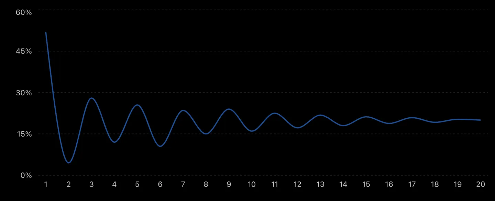
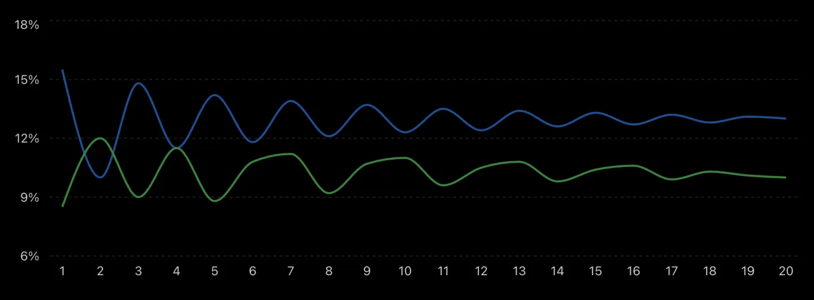
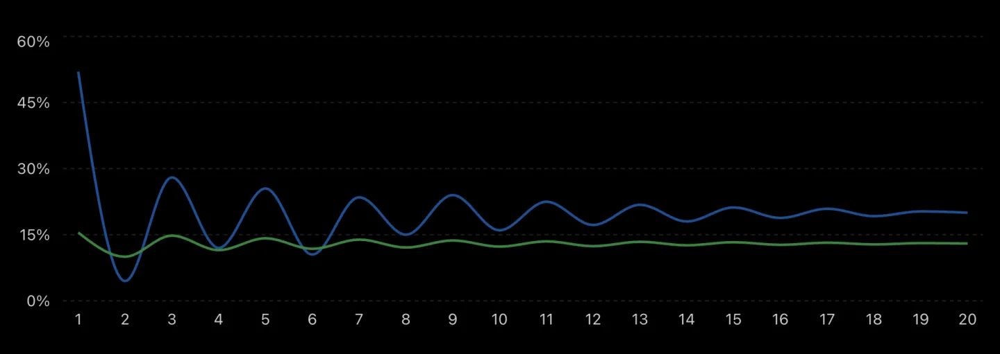

If one is managing one's own or other people's money, this is an important thing to ponder. Is one a good investor? Will one's decisions lead to meaningful alpha over what a conservative index fund delivers?

Let's take the example of a growth at reasonable prices (GARP) investor. Such an investor invests in high growth companies which are also available at reasonable prices. In short, the investor seeks mispricing in businesses that have strong growth prospects, so that one doesn't get stuck in neglected stocks for long periods due to low growth.

If the investor is sound in process, psychology and effort, then one can make good returns, let's say around 20% XIRR over a long period. How does one know? What is one's evidence for it?

One may say, why not measure one's XIRR and let the data speak for itself? But to decide based on this will be a mistake for at least the first 8 to 10 years, and here is why.

Let's take an investor who indeed ends up making 20% annualised return over 20 years. The look-back XIRR for that investor is likely to look like the diagram below, where the x-axis is the number of years in the journey and the y-axis is the look-back XIRR. Look-back XIRR is simply one's XIRR recalculated at the end of each year.

*Look-back XIRR is not a steady straight line.*

The psychological experience of this investor is a roller coaster ride in the initial years. A look-back XIRR of 28% at year 3 feels like proof of skill, and three years later the same investor is sitting at 13% and wondering whether any of it was real.

The early years are extremely noisy and oscillate between euphoria and disappointment. As time passes, the dispersion reduces and the look-back XIRR starts stabilizing around the investor's underlying skill level.

It is only in year 8 to 10 that one starts to get genuine signal, consistently above 15% and tending slightly upwards.

---

Consider another investor who is not as good, but holds the same conviction in one's approach. This investor converges to around 10%, while the index itself delivers 13%. In the long run, this investor would have been better off doing nothing active at all.

*Green: investor look-back XIRR. Blue: index look-back XIRR.*

Around year 2, this investor's look-back XIRR briefly rises above the index, so for that window the evidence appears to say the active approach is working, when it is not. The early volatility is what creates these crossings, and one in year 2 has no way to tell whether that outperformance is signal or noise.

So for many years one may simply not know whether what one has is skill or only confidence. Conviction is necessary and it is not sufficient, and the realized outcome over a long period is the only reliable evidence.

## Why does the chart dissipate with time?

As the weight of time increases, a 20 to 30% swing in portfolio value doesn't have as much impact on till-date XIRR. For example, 100 rupees after 15 years at 20% CAGR is 1540 rupees. A 30% drop means 1078 rupees, which is still around 17% CAGR.

## Why can't one get feedback by comparing to an index?

One must not compare the long-term average of an index with one's own annual returns. What matters is what the index does when one's clock starts. So let's discuss it by comparing against the plot of the index.

*Green: investor look-back XIRR. Blue: benchmark index look-back XIRR.*

Indexes like NIFTY 50 and NIFTY 250 give lower returns but are also less volatile. So in the initial years one moves above and below the index.

---

All of this makes for a very long test of conviction and expertise, where the feedback loop is slow and the early signals are deceptive.

A practical way to manage that uncertainty is to start with a smaller allocation of one's total portfolio in self-managed equity, perhaps 10 to 20 percent, which keeps the cost of being wrong low while still putting one through the real process. As the years accumulate and the look-back XIRR begins to stabilize above a meaningful threshold, one can grow that allocation.
