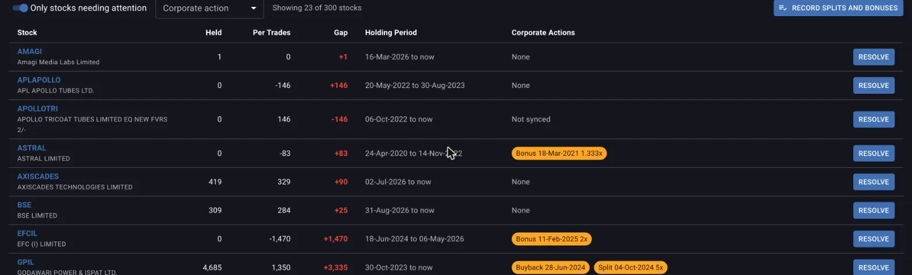
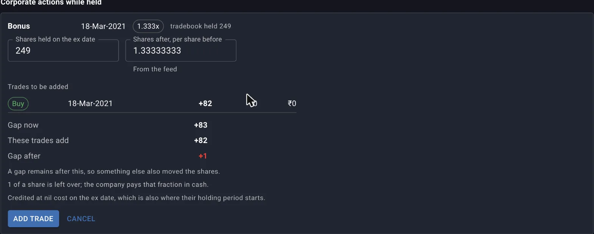
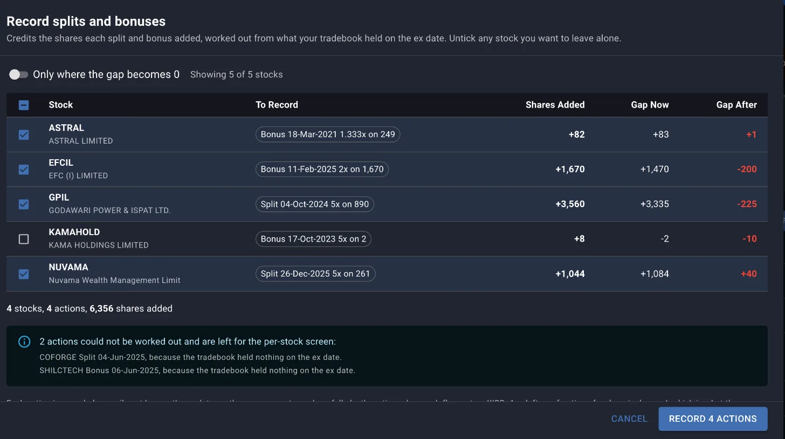

Margin builds your cost, your gains, your XIRR and your allocation from the trades on record, not from what your broker shows you are holding today, so the two have to agree: add up every buy and sell in your tradebook and it should land on exactly the quantity your demat account holds. The consistency check is where Margin compares the two and tells you where they don't.

The screen carries a **Work in progress** label, and Margin says so plainly on it. Treat what it reports as a lead to investigate, not a settled number. It can only name a cause for a stock whose corporate actions have been synced against the exchange feeds, and some kinds of gap it cannot see in the data at all. Act on what it does find anyway, because a gap keeps distorting your numbers until you close it.

## Opening the check

Consistency has its own screen under **Portfolio** in the top navigation, alongside Dashboard, Trades, Dividends, Ledger, Allocation and Unrealised Gains, and it opens straight into the whole portfolio table. You will also land on one stock's check directly, without going through the portfolio table first, from several places that already know something is wrong:

- The **Consistency** action on a stock's row in the Dashboard or a Stocks List.
- The **Source** chip on a trade generated by a recorded corporate action, in the Trades screen, which links back to the stock that produced it.
- A **Data gap** chip or a warning on the Stock Summary card, wherever a stock's returns are shown.
- A **Resolve** button next to a stock in the Unrealised Gains screen.

Each one lands on the same per-stock screen described below, scoped to that one stock.

## Reading the portfolio table

The table's **Held**, **Per Trades** and **Gap** columns are the whole reconciliation in three numbers. Held is what your demat import says you hold today. Per Trades is what your tradebook adds up to, buys less sells. Gap is the difference, and a stock needs attention only when that gap is more than half a share, since anything smaller is rounding and not a real mismatch.

Four summary cards sit above the table: how many stocks were checked, how many need attention, how many corporate actions are still waiting to be recorded, and how many stocks have never had their corporate actions synced against the exchange feeds at all. The last figure matters on its own, separately from the gap count, because a stock with no synced action data can be hiding a split or bonus the check has not even looked for yet.

**Only stocks needing attention** is on by default and hides everything that already reconciles, and **Corporate action** filters to stocks with a particular pending action type, split against bonus against demerger against buyback, and its counts follow whichever attention setting is on. Each row ends in a **Resolve** or **Review** button that takes you to that stock's own screen, Resolve when there is a gap to close and Review when the stock only has something worth reading.

*Every row past the first two agrees on quantity only after its pending corporate actions are recorded.*

## What can cause a gap

A gap with no corporate action listed against it is one the screen can flag but cannot explain, and it usually comes down to a handful of causes: a tradebook upload you never made, shares transferred in from another demat account, an IPO allotment that never went through a trade, or trades from before your tradebook's start date. The per-stock screen says as much when it finds a gap with nothing to attach it to. None of these show up as a recordable action, because Margin has no feed to check them against, only the missing shares themselves.

Where a corporate action feed has been synced for the stock, the picture is different. Margin already knows a split, bonus, demerger or buyback fell inside your holding period, and the recorded gap on the other side of it tells you whether you have accounted for it yet.

## Splits and bonuses that were never recorded

A split or a bonus does not touch your tradebook. Nothing about it looks like a buy or a sell, so unless you enter it yourself, your trade history keeps counting the shares you had before the corporate action while your demat account holds the shares you have after it, and the two drift apart by exactly the ratio.

Average cost is computed from quantity too, so a 1:1 bonus that is never recorded leaves your tradebook holding twice the real price per share, which understates every gain calculated from it and, on the sell side, overstates the tax paid. Margin names each corporate action by the type the exchange feed reports, shown as a chip carrying its label, its ex date and its ratio, for example a Split chip reading its ratio as a multiple. An outlined chip with a check mark has been recorded; a filled one is still waiting.

## Recording a corporate action for one stock

On a stock's own screen, under **Corporate actions while held**, each pending action gets a **Record** button, next to a note of what your tradebook held on the ex date, the quantity the credit is worked out from. Clicking it opens a small form with the inputs that action needs. A split or bonus asks for the shares held on the ex date and the ratio, both pre-filled from the feed. A buyback asks for the shares accepted, the price and the payout date, none of which the feed carries, so you supply them from your broker's buyback statement.

**Preview** shows the trades this would add to your tradebook before anything is saved, alongside the gap now, what these trades add, and the gap after, coloured green when it fully closes and red when it does not. A gap left open after recording means something else also moved the shares, so look into it before you record. If the ratio does not divide your holding evenly, the leftover fraction is called out too, since that fraction is what the company pays out in cash rather than in shares.

*A 1.333x bonus on 249 shares adds 82 shares at zero cost. One share of gap is left over here, which the note flags as something else having moved shares too.*

Saving inserts the previewed trades into your tradebook. A split or bonus is recorded as a nil cost buy on the ex date. That lowers your average cost per share and adds no cash flow to XIRR, since nothing left your pocket for it. The credited shares also start their own holding period on that ex date, separate from the shares you already held, so a sale of them has to wait out that fresh clock before it counts as long term. A buyback is recorded as a real sale at the price you enter, which does carry a cash flow and does count toward capital gains. Either way, the new trade shows up in the Trades screen tagged with a **Source** chip naming the action, and clicking it returns you to this check.

## Recording splits and bonuses across the whole portfolio

A portfolio that has run a few years usually ends up with more than one stock waiting on the same kind of action, and recording each split and bonus one at a time is the slow way to clear them. **Record splits and bonuses**, on the portfolio table, builds one plan for every ratio-based action across every stock at once, working the way the single-stock form does.

The plan lists what each stock would gain, the gap before and the gap it would leave after, with a checkbox per row and every stock the plan is confident about pre-ticked. **Only where the gap becomes 0** narrows the table to the rows that fully reconcile, since a row that leaves a gap behind is one you may want to look at individually instead. If you tick a stock that already reconciles today, a warning says so, because recording its action would open a gap where there was none, not close one; untick it unless you already know the demat figure itself is wrong.

Not every pending action makes it into this plan. One that the feed carries no usable ratio for, or where your tradebook held nothing on the ex date, is skipped and named, with the reason, so you know to go finish it on the per-stock screen instead. Buybacks and any action type not yet supported for recording never appear here at all, since neither has a ratio to work from. Applying the plan records every ticked action in one pass and reports how many actions and stocks it touched and how many shares it added; anything that failed is listed with the reason, and everything else can still be undone individually afterwards.

*Four of five stocks are ticked. KAMAHOLD is left unticked because recording its bonus would move its gap from -2 to -10, away from zero instead of toward it. Two more actions on other stocks are skipped outright, both because the tradebook held nothing on their ex date.*

## Undoing a recorded action

A recorded action can be undone from either the stock's consistency screen or the Trades screen. Both remove the whole action, along with every trade it generated, and the stock's gap reappears exactly as it was before you recorded it. Undo freely if you got an input wrong; it just means redoing the entry afterward.

## Scoping to one trading account

If you hold the same stock across more than one broker, the trading account picker at the top of the portfolio table narrows the check to a single account instead of your combined holding. The tradebook and the demat file are both account specific, so a gap that looks real once every account is summed together can turn out to be shares sitting correctly in a different account than the one you expected. Scoping to one account at a time is how you tell the two apart.

## Before you trust XIRR, gains or allocation

An unresolved gap shows up well past this screen. The Unrealised Gains screen says outright that its long term and short term gains are worked out from the tradebook, adjusted for whichever corporate actions have been synced or recorded, and that where the tradebook and the demat holding disagree, the figures for that stock cannot be trusted until the gap is resolved. A gapped stock's LTCG and STCG columns are left blank, with a **Resolve** button where the figures would be, and its own **Needs Attention** card carries the same count this screen does. Wherever a stock's XIRR is shown, the same **Data gap** warning follows it.

The cost your allocation screen compares against your target is drawn from the same trade history, so a stock whose cost is wrong because of an unrecorded split or bonus carries that error into its allocation gap too, even though nothing on that screen names it directly.

*AMAGI carries a one share gap, so its LTCG and STCG columns are blank instead of wrong. Eleven of forty-seven stocks need attention here today.*

Clearing the table takes well under a minute for most portfolios, and the bulk tool above closes a year's worth of splits and bonuses in one pass. Afterwards you can read a return, a gain or an allocation gap without having to wonder whether a forgotten bonus is sitting underneath it.

## Where to go next

- [Tracking expected returns from the dashboard](/guides/tracking-expected-returns-dashboard) is one of the screens whose figures a reconciled portfolio makes trustworthy.
- If a stock's gap traces back to a missing upload, [the funds statement, net invested and charges](/guides/funds-statement-ledger) and the [tradebook recipe](/recipes/tradebook-into-margin) cover getting your records complete.
- If your broker's file will not upload at all, [When Margin cannot read your broker's file](/guides/unsupported-broker-formats) covers what to do.
