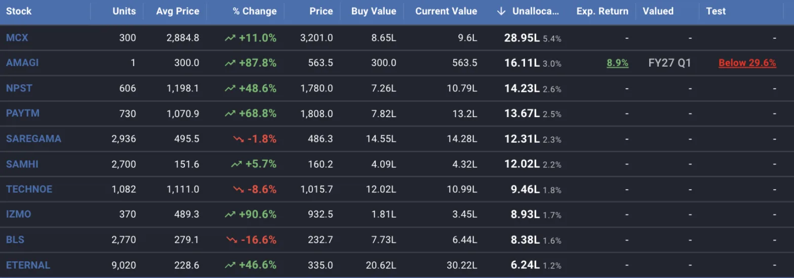
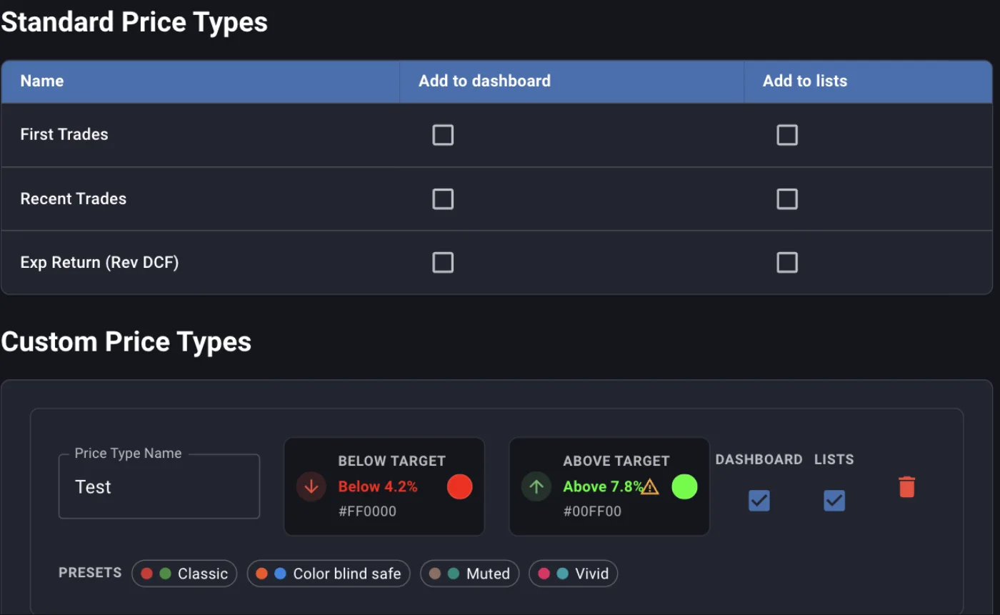
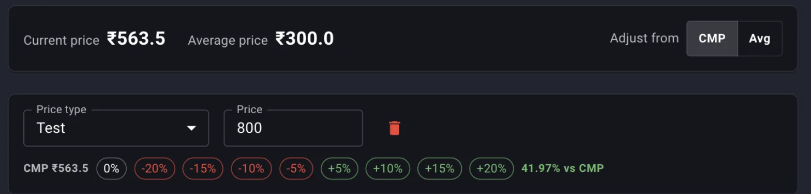
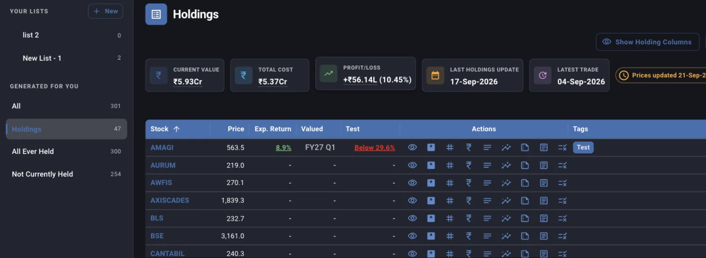
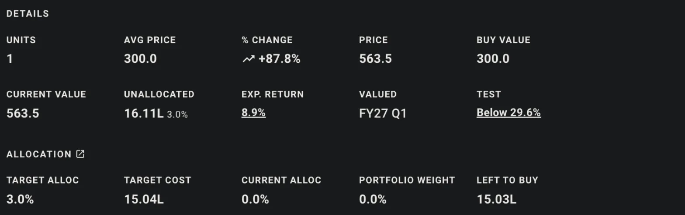

The dashboard is one row per holding, and every figure on the row is worked out from two things: the trades and holdings you uploaded, and the assumptions you recorded elsewhere in Margin, whether a DCF, a reverse DCF, a target allocation or a price you decided on in advance. Nothing on the row is typed in directly. When a cell is blank it means the assumption behind it has not been set for that stock yet, and the fix is on the screen that owns the assumption, not here.

The holding columns, the expected return and the valuation quarter are always present. What you choose is which price anchors and which reverse DCF figure join them, and you choose that in Settings, not on the dashboard. XIRR is not a column. It lives in the **Summary** dialog, both the one for a single stock and the one for the whole portfolio, where it is computed over a period you pick.

## Opening the dashboard

The dashboard is the first item under **Portfolio** in the top navigation. Above the table sit the trading account picker, when you have more than one account, six summary tiles, and the action buttons. The **Prices updated** chip on the right of the tiles matters for everything below it: quotes refresh once a day after market close, so every column that uses the price is an end-of-day figure, never an intraday one.

## The holding columns

These six come straight from your uploads and the daily quote, and they are always on the dashboard.

**What Margin computes**

- **Avg Price** is the cost per share your tradebook adds up to, buys less sells, adjusted for whatever corporate actions you have recorded. An unrecorded split or bonus leaves this figure too high, which is what the [consistency check](/guides/consistency-check) exists to catch.
- **% Change** is the day's closing price against that average cost, so it is your gain on the position, not the stock's move today.
- **Buy Value** is units times average cost, and **Current Value** is units times the closing price. The **Current Value**, **Total Cost** and **Profit/Loss** tiles above the table are these two columns summed over every row.

A holding you added by hand through **Add**, without a tradebook behind it, still shows all six, using the units and cost you typed.

## Unallocated

**Unallocated** is the gap between what you said a stock should be and what it is. The [Allocation screen](/guides/target-allocation) holds a target percentage for each stock. Margin multiplies that target by the cost of the whole portfolio, subtracts what you have actually paid for the holding, and shows the difference in rupees, with the same gap as a percentage of portfolio cost in small type beside it.

- A positive figure is room left to buy. A negative one, shown in red, means you hold more than the target allows.
- The percentage beside it is the gap as a share of the whole portfolio, so 3.0% next to 16.11L means the gap is three percent of everything you have invested. Reading it against the target itself tells you how far along you are: a 3.0% gap on a 3.0% target means you have barely started.
- A dash means no target has been set for that stock. Set one on the Allocation screen and the column fills on the next load.
- The portfolio cost the target is measured against is cost, not current value, so a stock that has doubled does not read as over-allocated on this column. **Portfolio Weight** in the row's detail panel is the value-based figure, if that is the one you want.

When you scope the dashboard to one trading account, the portfolio cost used here is that account's cost alone, and the gap is recomputed against it.

*Sorted by Unallocated, so the stocks with the most room left to buy come first. Only AMAGI has a DCF, a valuation quarter and a price anchor filled in; the rest are waiting on those assumptions.*

## Exp. Return and Valued

**Exp. Return** is the annualised return implied by your most recent DCF for the stock, recalculated at today's closing price. Margin takes the intrinsic value your DCF reaches at the year you chose for the projection, divides it by today's price adjusted for the company's net debt, and annualises over that many years. Hovering the cell shows the horizon, for example *Over 3 years from most recent DCF*. Green is positive and red is negative, and the figure is a link that opens the DCF it came from.

**Valued** is the financial quarter the most recent valuation was made for, DCF or reverse DCF, whichever is later. It reads *FY27 Q1* for a quarterly result and just *FY27* when the valuation was made on the full-year figures. Its job is to show which holdings are valued on stale numbers without your opening each valuation to check. It carries no link.

Both are blank until the stock has a saved valuation. A DCF whose expected return cannot be computed, because the intrinsic value or the price comes out at zero or below, also shows a dash.

## Adding price anchors and the reverse DCF return

The optional columns come from **Settings**, under **Price Types**. This section is only shown on a desktop-width screen. There are two groups, and each row has an **Add to dashboard** and an **Add to lists** checkbox, so a column can be on the dashboard, on your stock lists, on both or on neither.

*The standard types are off by default. The custom type below them has a warning against its green because that shade is hard to read on one of the two themes.*

**Standard price types**

- **First Trades** is your average cost on the first day you ever traded the stock, and **Recent Trades** is your cost on the most recent day you traded it. Both are read from the tradebook. The column shows how far that cost sits from today's price, as a percentage.
- **Exp Return (Rev DCF)** is the annualised return implied by your most recent reverse DCF, recomputed at today's price and today's trailing twelve month earnings using the exit multiple, growth rate and years you saved in it. It is the counterpart of **Exp. Return** for the other valuation method, and clicking it opens that reverse DCF.

**Custom price types**

A custom type is a name you give to a price you will set per stock, such as an entry level or an exit level. Each type has a colour for when the market price is below your figure and another for when it is above, so a glance down the column tells you which side of your line each stock is on. Pick a preset pair or open either colour; Margin shows how the colour reads on both the light and the dark theme and warns when it is too faint on one of them. The name is the column heading, and it is required. **Save** at the bottom writes both groups at once, the standard toggles and the custom types together.

## Setting a price for one stock

A custom price type gives you a column; the number in it is set per stock. Click the rupee icon in a row's actions, or the value already in the column, to open **Your prices for** that stock.

*A Test price of 800 against a closing price of 563.5. The chips set the price as a step from the base, and the figure at the end reads back how far the price you typed sits from it.*

- Each row pairs a price type with a price. **Add Price** adds a row, and the bin removes one.
- **Adjust from** switches the base between the current price and your average cost, and the percentage chips set the price to that base plus or minus the step. The figure after the chips reads back where the price you typed sits against the base, whichever way you arrived at it.
- A type can be used once per stock. Saving with the same type on two rows stops with *Duplicate price types are not allowed*, and a row missing either its type or its price is flagged and not saved.
- If you have not created any price types yet the dialog says so and points you to Settings.

Back on the dashboard the column shows the closing price against your figure as *Above 12.3%* or *Below 29.6%*, in the colour you gave that side. The standard price columns run the other way, cost against price, which is why they read as a plain percentage without the word.

## Reading the gap, the anchor and the return together

**Unallocated**, **Exp. Return** and a custom price sit side by side because each answers a different question about the same buy. Take the AMAGI row in the screenshot above: **Unallocated** shows 16.11L of room, three percent of the portfolio, so the allocation plan says buy. **Exp. Return** shows 8.9% over three years from the DCF, which says the price is not a bargain by your own model. **Test** shows the price 29.6% below the 800 you set, which says it has not reached the level you wrote down before the market moved.

Each column alone gives a different instruction, while together they say the position has room but the price has not earned it yet, and the number to watch is which of the last two moves first. The same three columns on a stock with a negative gap tell the opposite story: over target, and if the expected return has also fallen below your hurdle, a candidate to trim whatever the position's own gain or loss says.

Check **Valued** before acting on any of the three. A 30% expected return computed on a valuation from six quarters ago describes a company that no longer exists in that form, so open the valuation and bring it up to the current quarter first.

## Sorting

Click any column heading to sort by it; click again to reverse, and a third time to clear. The table opens sorted by stock symbol. There is no column menu on the headings, so there is no per-column filter and no way to hide a column from the table itself; what you see is the fixed set plus whatever you switched on in Settings.

The sort you pick is not remembered. Reload the page and the table is back on symbol order.

## Scoping to a trading account

The **Trading account** picker above the tiles appears only when you have holdings at more than one broker. Choosing one account narrows every figure on the screen to it: the rows, the tiles, the portfolio cost that **Unallocated** measures against, and the **Summary** dialog. A stock you hold at two brokers shows as one row with both accounts combined when the picker is on **All trading accounts**, and as that account's units and cost alone when you pick one. The stock's detail panel lists the units and cost at each account under **Trading Accounts** if you need to see the split without switching.

The picker resets to all accounts on reload, the same as the sort.

## The same columns on your lists

Filtering the dashboard by list or tag is done on a different screen. **Your Lists**, under **Research**, shows any list in the same grid, with the same expected return, valuation quarter and price columns, and Margin generates four lists for you: **All**, **Holdings**, **All Ever Held** and **Not Currently Held**. **All** is every stock you track in Margin, **Holdings** is the dashboard's rows in list form, **All Ever Held** is every tracked stock you hold now or have ever traded, and **Not Currently Held** is the remainder: stocks you have valued, tagged or listed without a trade in any account.

*The Holdings list carries the same rows as the dashboard, with the six holding columns hidden until you ask for them.*

Two things differ from the dashboard:

- The holding columns are hidden by default, because most lists hold stocks you do not own. **Show Holding Columns** brings them back for the rows that have a holding.
- A price type appears here only if its **Add to lists** box is ticked, independently of its dashboard setting.

The **Tags** column shows every tag on the stock, and the tag icon in the row's actions opens the dialog to add or remove them. There is no tag filter on either grid, so a tag is a label you can read and sort on, while a list is the tool for a set of stocks you want to look at on their own.

## Opening a row

Double-click a row, or choose **View** from its actions, to open the stock's detail panel. The **Details** block at the top is the row's columns laid out with room to read, including any price columns, and below it is an **Allocation** block the grid does not have: the target percentage, the target cost it works out to, the current allocation by cost, the portfolio weight by value, and **Left To Buy**, which is **Unallocated** by another name.

*Current Alloc is by cost and Portfolio Weight is by value, which is why a stock that has run up reads differently on the two.*

Further down, the panel lists the valuations, notes and prices the stock has, and which of your lists it belongs to. Ticking a list there adds the stock to it immediately, without a separate save.

## On a phone

The grid drops columns as the screen narrows so the rows stay readable. Below tablet width, **Units**, **Avg Price** and **Buy Value** go; on a phone, **Current Value** goes too. **% Change**, **Price**, **Unallocated** and everything after them stay. The action icons collapse into a single menu per row below desktop width, and the upload and delete buttons above the table are hidden on a phone altogether, since the files they need live on your computer. If you want them anyway, the **Show desktop actions on mobile** switch on your profile page turns them back on.

## What is saved, and what is not

The dashboard itself has no Save. Everything it shows is read fresh on each load from what other screens saved:

- Which price columns appear, and their colours, are saved by **Save** on the Price Types settings.
- The price in a column for one stock is saved by **Save** in the **Your prices** dialog, and tags by **Save** in the tags dialog.
- The target behind **Unallocated** is saved on the Allocation screen, and the valuations behind **Exp. Return**, **Valued** and **Exp Return (Rev DCF)** on their own grids.

The sort, the trading account you picked, and anything typed into a dialog you then closed are not kept.

## Where to go next

- [Tracking expected returns via the dashboard](/guides/tracking-expected-returns-dashboard) covers what to do with the expected return figure once it is on screen.
- [Using the DCF valuation grid](/guides/dcf-valuation-grid) is where the expected return and the valuation quarter are set.
- [The consistency check](/guides/consistency-check) is the screen to visit when **Avg Price** looks wrong, since every holding column downstream of it inherits the error.
- [Setting and reading target allocation](/guides/target-allocation) is where the target behind **Unallocated** is set, and covers why **Portfolio Weight** in the detail panel reads differently from it.
