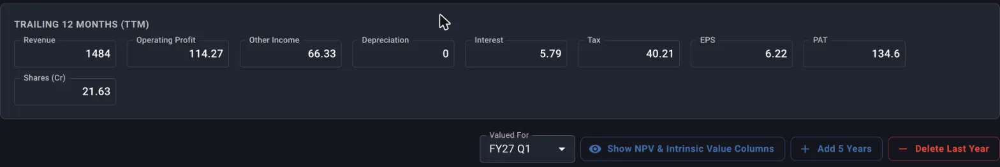
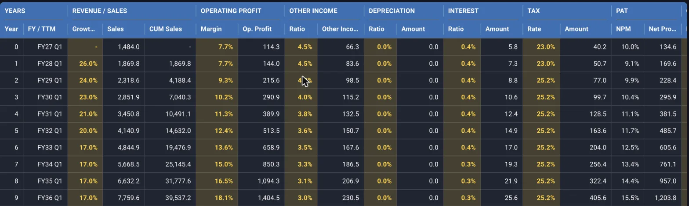
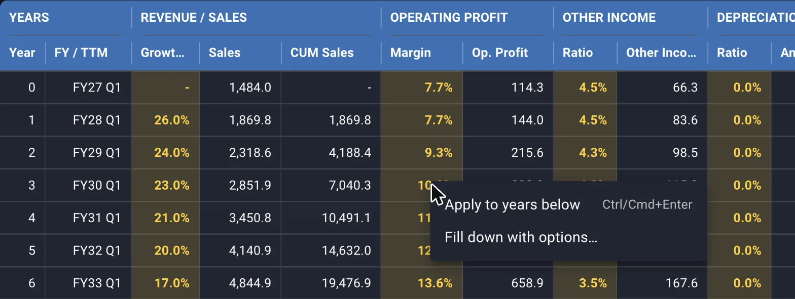
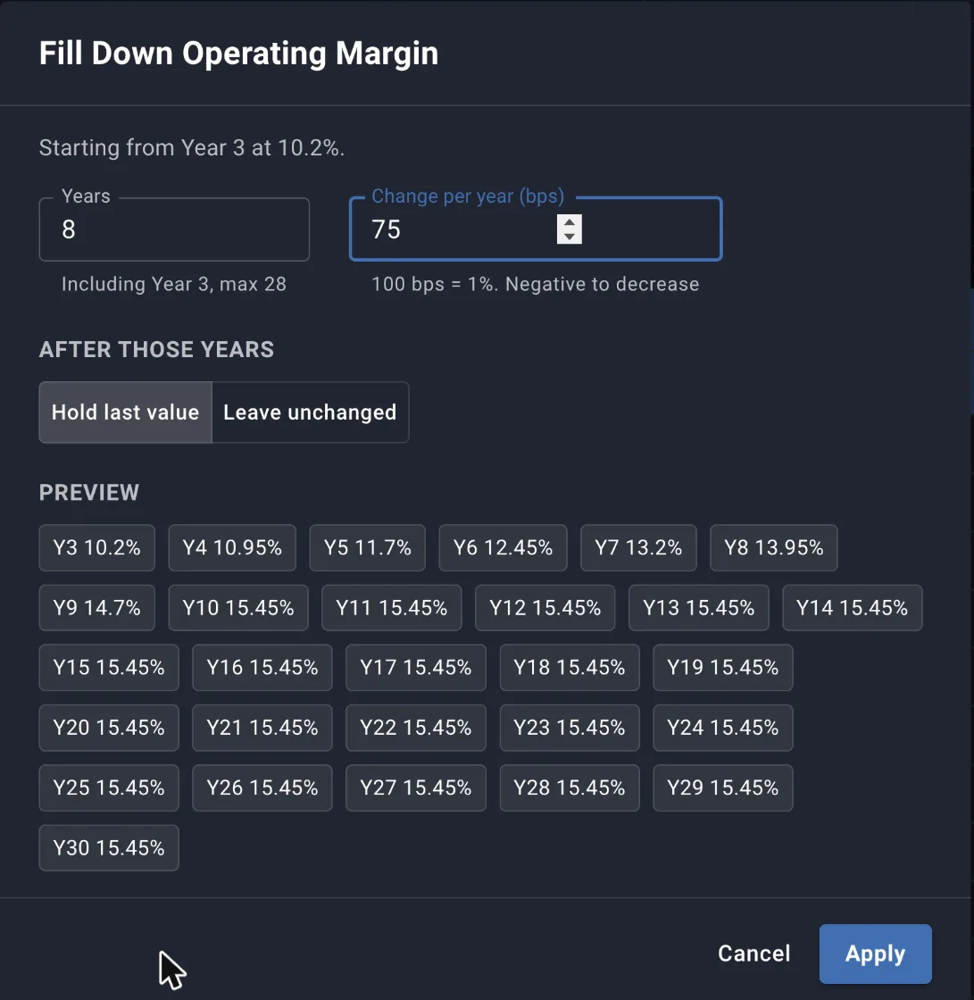
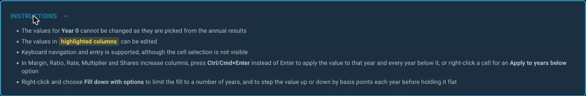
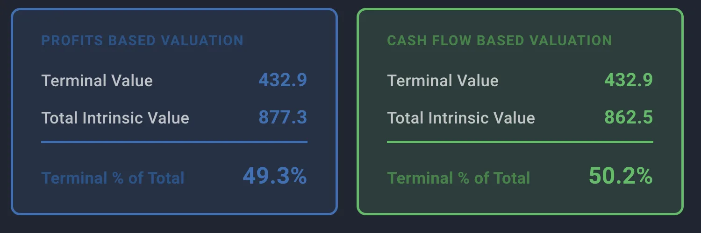
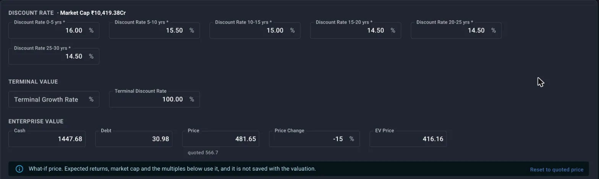
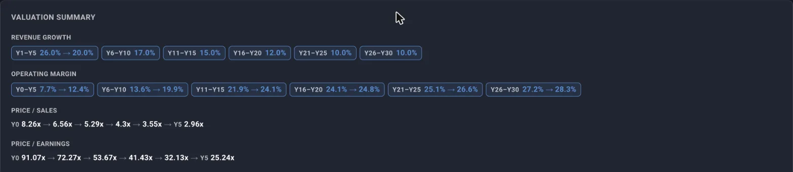

A DCF in Margin is one screen. The grid at the top holds the projection, one row per year. The panels below it hold the discount rate, the terminal value, the price you are valuing against, and your note. Everything recalculates in the browser as you type, so you can move an assumption and watch the intrinsic value move with it.

This guide walks through the screen in the order you use it.

## Opening a valuation

- Open a stock and go to its **Valuations** page.
- Press **DCF Valuation** to start a new one, or click an existing card to reopen it.
- Each valuation has its own name, so a single stock can carry a base case, a bear case and an old view from last year side by side.
- Creating a DCF needs a desktop screen. The saved valuations are readable on a phone.

## The TTM block

Above the grid sits **Trailing 12 Months (TTM)**. Margin does not fill this in for you. You type in the company's trailing twelve month numbers yourself, and every projected year is built off what you enter.

- **Revenue, Operating Profit, Other Income, Depreciation, Interest, Tax** and **EPS** are the fields you fill in.
- **PAT** and **Shares (Cr)** are computed and read only. Shares comes from PAT divided by EPS, so getting EPS right also gets the share count right.
- Leave out anything you do not want to project forward, such as a one off gain or an exceptional write off.
- Everything in the grid moves when you change a TTM field, because Year 0 is the TTM year.

*The TTM block, and the row of controls that sits between it and the grid.*

## The grid, column by column

The grid has one row per year. **Year 0** is the TTM year and cannot be edited. Its values are the starting point the projection grows from.

Editable cells are highlighted, and everything else is calculated from them.

*The gold cells are yours to set. Year 0 carries the TTM figures and is locked.*

**What you set:**

- **Growth %** under REVENUE / SALES, the revenue growth for that year over the year before it.
- **Margin** under OPERATING PROFIT, the operating margin for the year, applied to that year's sales.
- **Ratio** under OTHER INCOME, other income as a percentage of sales.
- **Ratio** under DEPRECIATION, depreciation as a percentage of sales.
- **Ratio** under INTEREST, interest cost as a percentage of sales.
- **Rate** under TAX, the effective tax rate on profit before tax.
- **Multiplier** under CASH FLOW, what one rupee of net profit turns into as cash. Capex and working capital enter the model here. A company that funds growth out of the profit it reports converts at less than 1. A depreciation heavy business with light capex converts at more than 1.
- **Shares increase** under DILUTION, the percentage the share count grows that year. Set it above zero if you expect ESOPs, a QIP or a conversion, and the per share numbers absorb it.

**What Margin computes:**

- Sales, CUM Sales, Op. Profit, Other Income, Depreciation, Interest, Tax, NPM, Net Profit, Cash flow and EPS for each year.
- **NET PRESENT VALUE**, each year's profit, cash flow and per share value discounted back to today.
- **CUMULATIVE NPV**, the running total, with and without terminal value.
- **INTRINSIC VALUE**, what the remaining years plus terminal value are worth, seen from that year.
- **EXPECTED RETURNS**, the annual return from today's price to that year's intrinsic value.

The last four groups are hidden until you press **Show NPV & Intrinsic Value Columns**. Keep them hidden while you set assumptions, and open them when you want to read the working.

Keyboard navigation works across the grid. The cell selection is not drawn, so the cursor is easy to lose. Arrow keys and typing still move and edit normally.

## Filling a value down the years

Typing the same margin into ten rows is the part of a DCF that goes wrong quietly. The grid gives you three ways to avoid it, on the Margin, Ratio, Rate, Multiplier and Shares increase columns.

**1. Ctrl/Cmd+Enter while editing**

- Type the value into a cell and press **Ctrl+Enter** or **Cmd+Enter** instead of Enter.
- The value lands in that year and in every year below it.

**2. Right-click, Apply to years below**

- Right-click a cell that already holds a value.
- Choose **Apply to years below**. Same result as Ctrl/Cmd+Enter, without retyping the number.

*Right-clicking Year 3's margin. The menu also shows the Ctrl/Cmd+Enter shortcut for the same action.*

**3. Right-click, Fill down with options**

This is for assumptions that should drift rather than stay flat, such as a margin you expect to compress as competition arrives, or a growth ratio that fades as the base gets larger.

The dialog takes three inputs:

- **Years**, how many years the drift runs for, counting the year you right-clicked. The maximum is that year plus every year below it.
- **Change per year (bps)**, how much the value moves each year. 100 bps is 1% on a percentage column and 0.01 on the Multiplier. Enter a negative number to step down.
- **After those years**, either **Hold last value**, which carries the final stepped value through to the end of the projection, or **Leave unchanged**, which stops there and leaves later years as they are.

*A margin of 10.2% climbing 75 bps a year for 8 years, then held at 15.45% for the rest of the projection. The preview shows every year before you commit.*

The preview strip shows the resulting value for each year before you apply it, so you can see where a 75 bps a year drift actually lands in Year 10.

## Right-click options at a glance

- Right-click works on **Margin, Ratio, Rate, Multiplier** and **Shares increase** cells.
- The cell must already hold a number, and there must be at least one year below it. Otherwise no menu appears.
- **Apply to years below** copies the value straight down.
- **Fill down with options...** opens the dialog above.
- Growth % has no fill down, by design. Revenue growth is the assumption the whole model turns on, so the grid asks you to set it year by year.

The same rules are written into the **INSTRUCTIONS** panel at the top of the screen, collapsed by default.

*The in-app version of this section, one click away while you work.*

## Discount rate

Below the grid, the **Discount Rate** section asks for one rate per five year band, labelled 0-5 yrs, 5-10 yrs and so on. A twenty year projection asks for four rates.

- Intrinsic value is not computed until every band has a rate. A warning shows while one is missing, and Save is blocked.
- The rate is the return you want for taking this risk. A higher rate values the same cash flows lower.
- Bands let you charge more for the distant years, where you know less.
- **Market Cap** is printed next to the heading, using the price currently in the Enterprise Value section.
- **Reference rates by market cap** expands a table of the rates you have configured in settings, so you can size the rate against the company without leaving the screen.

## Terminal value

Next to the discount rate sit two fields:

- **Terminal Growth Rate**, the rate the business grows at forever after the last projected year.
- **Terminal Discount Rate**, the rate that perpetuity is discounted at.

Terminal growth must be positive and must be lower than the terminal discount rate. Margin blocks the save otherwise, because the arithmetic gives an infinite value once growth catches the discount rate.

The two cards at the bottom of the screen show, for both the profit basis and the cash flow basis:

- **Terminal Value** per share.
- **Total Intrinsic Value** per share.
- **Terminal % of Total**.

*Half the value here comes from the terminal number, on both bases.*

Read the third line every time. If 80% of the value sits in the terminal number, the perpetuity assumption is carrying the valuation and the years you spent projecting barely move it. Adding more forecast years, or cutting terminal growth, brings the share down.

## Enterprise value and the what-if price

The **Enterprise Value** section is where the model meets the market price.

- **Cash** and **Debt** are in the same unit as TTM revenue. They convert the share price into an enterprise value per share, which is what expected returns are measured against.
- **Price** starts at the latest quote, with the quote date shown under it.
- **Price Change** does the same thing as a percentage. Setting either one updates the other.
- **EV Price** is read only. It is the price adjusted by net debt per share.

Change the price and a banner appears saying the what-if price is in use, with a **Reset to quoted price** button. While it is on:

- Expected returns, market cap, and the Price / Sales and Price / Earnings lines in the Valuation Summary all use it.
- The price is **not saved** with the valuation. Reopen the valuation later and it is back on the live quote.

Use it to answer questions like what this stock needs to fall to before the expected return clears your hurdle.

*A 30 year projection needs six discount rate bands. The price here has been marked down 15% from the quote of 566.7, and the banner spells out what that does and does not affect.*

## Dashboard expected return

Two settings decide what the dashboard shows for this stock:

- **Years**, the horizon the expected return is measured over.
- **Profit** or **Cash Flow**, which of the two intrinsic values the dashboard reads.

Both are saved with the valuation.

## Valued for, and the quarter anchor

The **Valued For** dropdown sits to the left of the grid buttons and holds the recent quarters.

- It records the quarter whose results this valuation was built on.
- It appears on the valuation card, in the DCF Valuations list, and next to the terminal year.
- A valuation you open a year later still names the results it was built on, so you know whether the assumptions have been overtaken by two more quarters of numbers.

## Adding and removing years

- **Add 5 Years** extends the projection by five years, seeded from the last year's assumptions.
- **Delete Last Year** removes the final year. It stops at one year.
- Adding years past a five year boundary adds a discount rate band, which you then have to fill in.

## Reference ratios and the valuation summary

Two panels sit between the header and the grid.

**Reference Ratios** shows the ratios you have saved in settings for this screen, such as a sector median P/E or the company's own five year median EV/EBITDA. The multiple you judge a business by stays on screen while you set the assumption that produces it.

**Valuation Summary** condenses the grid into four lines:

- **Revenue Growth**, grouped into bands, shown as Y1-Y3 18% or Y4-Y10 18% to 12% when the value drifts.
- **Operating Margin**, the same treatment.
- **Price / Sales** and **Price / Earnings**, what the current price works out to as a multiple of each projected year.

*Thirty years of assumptions in four lines. The P/E falls from 91x today to 25x by Year 5 on these numbers.*

The multiple trend is the fastest check on a projection. If the price you are paying today only looks sensible at a Year 8 P/E of 12, you are being asked to wait eight years for the business to grow into the price.

## Name and note

- **Valuation Name** sits next to the stock symbol in the header. Name it for the case it represents, such as Base, Bear, or Post capex cycle.
- **Note** is a rich text field at the bottom. Record what you were underwriting: why the margin holds, what the growth depends on, what would make you abandon the view.

The note is the part you will thank yourself for. Assumptions age, and six months later the number is unreadable without the reasoning behind it.

## CSV in and out

The toolbar in the header handles bulk edits.

- **Download Grid** exports the grid as you see it, all columns and groups included.
- **Upload CSV** applies a file to the screen. It is parsed and recalculated in your browser, and nothing reaches the server until you press Save.
- The **info icon** opens the format, with **Download current as CSV** inside it. Exporting the current valuation is the easiest way to get a file in the right shape to edit.
- The file has four sections, `[valuation]`, `[ttm]`, `[terminal]` and `[projections]`. Every section except `[valuation]` is optional, so you can upload only the part you want to change. The screen resizes to the years present in `[projections]`.

Building a model in a spreadsheet and bringing it in is covered in the [spreadsheet DCF recipe](/recipes/spreadsheet-dcf-into-margin).

## Saving

Press **Save** when the valuation is ready. Margin checks three things first:

- Every discount rate band has a rate.
- Terminal growth and terminal discount rates are set and valid.
- The valuation has a name.

Saved: the projection, the TTM figures, discount rates, terminal values, cash and debt, the dashboard settings, the quarter, the name and the note.

Not saved: the what-if price.

## Where to go next

- The saved valuation drives the expected return on your [dashboard](/guides/tracking-expected-returns-dashboard).
- To work the other way round, starting from the price and solving for the growth it implies, use a Reverse DCF from the same Valuations page.
- To decide whether a business deserves this much work before you start, run it through [qualitative screening](/guides/qualitative-screening).
