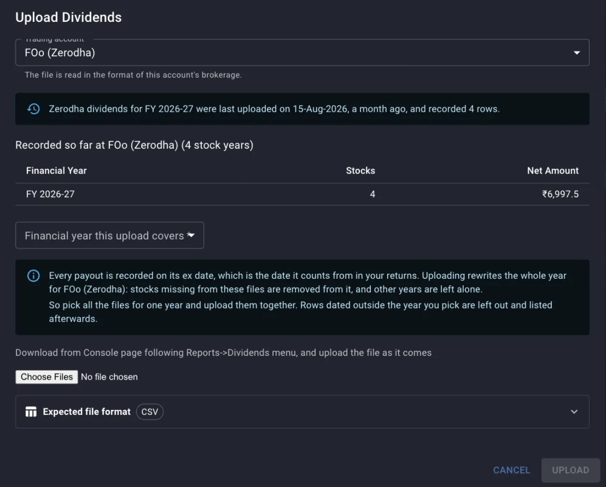
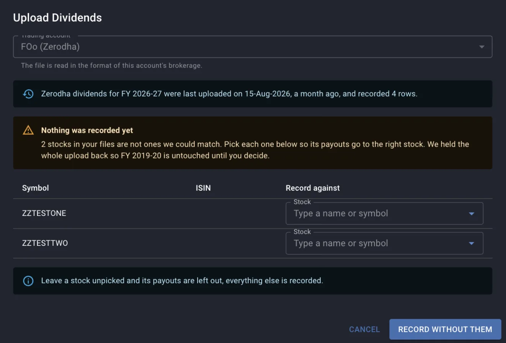
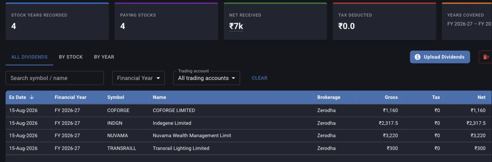

A dividend is cash your holdings paid you, and nothing in a holdings file or a tradebook records it. The Dividends screen is where that cash goes on record, one payout per stock per ex-date, and every payout then counts as money returned on its date in the XIRR of that stock and of the whole portfolio. Uploads go in a financial year at a time, and the year is the unit Margin rewrites and deletes.

The screen sits under **Portfolio** and then **Dividends** in the top navigation. Uploading and deleting need a desktop screen; on a phone the three tabs are read only. This guide covers the rules the screen does not print: what an upload replaces, which date decides the year, what is derived and then discarded from each row, and what a year you have not uploaded does to the return you read everywhere else.

## Choosing the trading account and the year

Uploading asks for two things before it will take a file, and both change what the upload writes.

**What you set**

- The trading account the file belongs to. The file is read in the format of that account's brokerage, so an account at a brokerage whose dividend format Margin does not read yet gets a dialog explaining how to send the layout instead of a file picker. [When Margin cannot read your broker's file](/guides/unsupported-broker-formats) lists what is read today.
- **Financial year this upload covers**. The picker offers the current financial year and twenty-one before it, labelled the way Indian tax years are written, so **FY 2026-27** means April 2026 to March 2027.

**What Margin computes**

- **Recorded so far at this account** lists every financial year that already holds dividends for the account you picked, with the number of stocks and the net amount in each. Read it before you choose a year, because the row you are about to overwrite is in that table.
- A note above it says when dividends for this brokerage were last uploaded and how many rows that upload recorded.

*The year picker reads FY 2019-20 while the table above it shows the only year on record is FY 2026-27, holding four stocks and 6,997.50 net.*

## What an upload replaces

An upload does not add rows to a year. It replaces the year: Margin deletes every dividend held for that trading account and that financial year, then writes what your files contain.

Sending the same file twice is therefore safe, because the second upload rewrites the year with the same payouts. Half a year is another matter, because a stock that was recorded before and is absent from the files you just sent is gone from that year. The dialog lists those stocks under **Removed from FY ...** with the net amount that went with them, so gather every file for a year and upload them in one go.

The replacement is scoped to the account and the year you chose, and no other year or account is touched. Two accounts at the same brokerage stay apart only if you added them as two trading accounts; anything sent to one account replaces that account's copy of the year.

A file uploaded against the wrong year is the case that costs you data. If no row in it falls inside the year you picked, Margin has nothing to write and the year is emptied. The dialog says so plainly, naming the year that now holds nothing for the account, and the fix is to upload the correct files for that year again.

## Rows dated outside the year you picked

Rows in the file dated outside the chosen year are left out of the upload and listed afterwards with the symbol, the ex-date and the financial year they do belong to. Nothing is written for those years, so upload the same file again with each of those years picked. A statement that spans two years therefore goes in twice, once per year, and each pass rewrites only its own year.

## Stocks Margin could not match

Each row is matched to a stock you already track, by the symbol and the ISIN in the file. When any row names a stock Margin cannot place, the whole upload is held back: nothing is written, and the year stays exactly as it was until you decide.

*Two symbols that match no stock. The year named in the warning is untouched while this table is open, and the button records the rest only when you press it.*

**What you set**

- **Record against**, one stock per unmatched row, typed as a name or a symbol.

**What Margin computes**

- The button label counts what you have picked, so it reads **Record with 2 stocks picked** once two are chosen and **Record without them** while none are.
- Pressing the button with a row left unpicked records everything else and drops that stock's payouts from the year, which are then listed as left out. To keep them, close the dialog, add the stock to Margin, and upload the year again.

A symbol usually goes unmatched because the company is not in your Margin universe yet, or because the brokerage writes a symbol Margin holds under another spelling, so a suffix such as `BLS#` goes in as the file writes it.

## Why the ex-date is the date on record

Margin stores one date per payout. Where a statement carries a payment or credit date, that date is used; where it carries only an ex-date, the ex-date is what is kept, and several brokerage exports report nothing else. The **Ex Date** column is that stored date.

The stored date decides two things:

- Which financial year the payout belongs to, and therefore which year an upload puts it in and which year a deletion takes it out of.
- Where the cash flow sits in XIRR. A payout is a return on its date, and moving the date moves the rate.

The credit date sits somewhere between a few days and a few weeks after the ex-date, so a payout with an ex-date in late March and a credit in April lands in the earlier financial year. Read the year totals with that in mind when you reconcile them against a bank statement.

## What each row leaves behind

A statement row usually carries a quantity and a rate per share as well as amounts. Margin reads all of it and keeps only part of it.

- **Gross** is taken from the file when it has a gross column. Otherwise it is net plus tax, and failing that, quantity multiplied by dividend per share. A row that gives none of these combinations stops the file and the message names the row.
- **Tax** is whatever the file reports as deducted at source, and zero when the file has no such column.
- **Net** is the file's net figure, or gross less tax. This is the number that reaches your return.
- The quantity and the rate per share are used to work out the amount and are not stored, so there is no per-share history and no column for either.

Because tax defaults to zero, a statement with no TDS column gives every row a net equal to its gross, and the **Tax Deducted** card reads zero across the portfolio. That figure reports what your files carried, while the registrar may well have withheld more.

Two rows for the same stock on the same ex-date are added together into one payout. A stock that paid twice in a year on two different dates stays two payouts, each with its own date.

## The summary cards

The five cards above the tabs cover every trading account, and the trading account picker inside each tab does not narrow them.

- **Stock Years Recorded** counts stored payouts, one per stock per ex-date, so a stock paying twice in a year adds two.
- **Paying Stocks** is the number of distinct stocks with at least one payout.
- **Net Received** and **Tax Deducted** are the sums of the net and tax columns of every payout on record.
- **Years Covered** runs from the earliest financial year holding a payout to the latest. It reports the span of the record while saying nothing about whether the years inside that span are complete, so a year you skipped shows up only as a missing row in the **By Year** tab.

*A statement that carries no tax column. Gross and Net match on every row, and Tax Deducted stays at zero.*

## All Dividends, By Stock and By Year

The three tabs are three groupings of the same payouts, each with a trading account picker that scopes the rows under it.

- **All Dividends** is one row per payout, sorted by ex-date with the newest first. Sorting and paging run on the server, so the sort applies to the whole record and not to the page on screen.
- **By Stock** rolls the payouts up per stock, with the number of financial years it has paid in, the number of payouts, the totals, and the last year and ex-date it paid. Clicking a row jumps to **All Dividends** filtered to that symbol.
- **By Year** groups by financial year, April to March. Its **Stocks** column counts distinct stocks in that year, so it does not match the payout count when a stock paid more than once.

## How a payout enters your return

Every payout becomes a positive cash flow on its ex-date, sitting alongside the buys and sells from your tradebook in the same XIRR calculation. Payouts on a date that already carries a trade are added to that day's figure.

Which payouts are included depends on what you are looking at. A stock's own XIRR counts only that stock's payouts. The portfolio XIRR counts every payout in the trading accounts in scope, including stocks you have since sold in full, which matches the trade side counting every trade you ever made. The **XIRR by period** panel narrows this to one window: only payouts dated inside the period are counted, and their total is the **Dividends** figure in the cash flow group beside **Bought** and **Sold**. The gain for a period is the closing value plus sells plus dividends, less the opening value plus buys, so a missing payout lowers the gain, the absolute return and the annualised rate together.

A financial year you have never uploaded understates your return by whatever it paid, on the stock and on the portfolio, and the understatement compounds with how long you have held. Nothing on the screen flags it, which is why **Years Covered** and the **By Year** tab are worth reading before you treat any return figure as settled.

## Deleting a payout, a stock or a year

Four deletions exist, all permanent, and they differ in how much they take. The confirmation names what is about to go, so read it before the icon.

- The bin on an **All Dividends** row deletes that one payout.
- The bin on a **By Stock** row deletes every payout of that stock inside the **Financial Year** and **Trading account** filters set above the grid. With **Financial Year** left at All, that is every year the stock has ever paid.
- The bin on a **By Year** row deletes that year for the trading account selected on the tab.
- **Delete All Dividends** clears every payout across every trading account and every year.

Deleting is also the way to correct a year uploaded under the wrong trading account, since an upload only ever rewrites the account it was sent to. Clear the year at the wrong account, then upload it at the right one.

## Where to go next

- [When Margin cannot read your broker's file](/guides/unsupported-broker-formats) lists the brokerages read today and explains how to send a format that is missing.
- [A year of dividends on record](/recipes/dividends-into-margin) covers the same upload through the API, for an agent doing it for you.
- [The funds statement, net invested and charges](/guides/funds-statement-ledger) records the other half of the cash story, the money you moved in and out of the broker.
- [Reading the dashboard columns](/guides/dashboard-columns) explains where XIRR lives once the dividends are on record.
