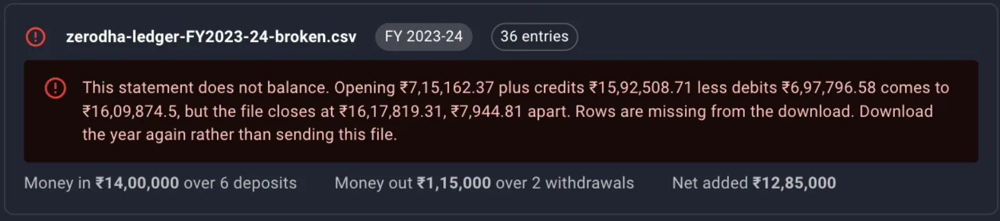
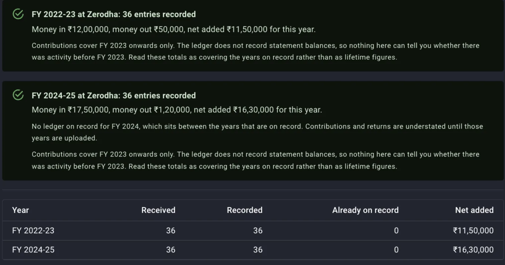
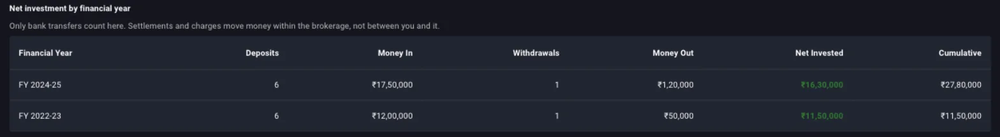
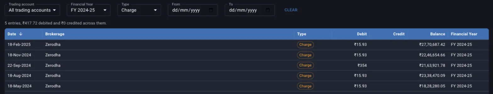
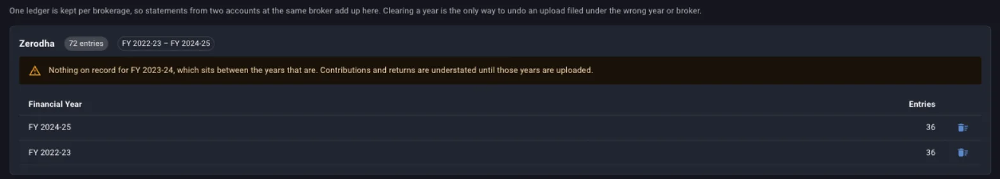

The funds statement is the record of cash moving between your bank and your broker. Margin reads it to answer one question that holdings and trades cannot: how much of your own money you have actually put in. Everything on the **Funds Ledger** screen is built from statement rows, one financial year at a time, and nothing on it changes until you upload another year or clear one.

The screen sits under **Portfolio** and then **Ledger** in the top navigation. Uploading and clearing need a desktop screen; on a phone the ledger is read only. This guide covers the rules the screen does not print: what a file must contain, what each figure counts, and what a missing year does to the totals.

## Getting the statement from your broker

Margin reads one financial year per file, and the file must carry the broker's own **Opening Balance** and **Closing Balance** lines, because those two figures are what every row is checked against. For a supported brokerage the upload dialog tells you where the file is downloaded from, and it goes in exactly as the broker exports it. [When Margin cannot read your broker's file](/guides/unsupported-broker-formats) lists the supported brokerages.

Download every year you have held the account. A year left out leaves a hole in the record, and the section on years on record explains what that hole does to the totals.

## Which trading account the file belongs to

The file is read in the format of the trading account's brokerage, so the account you pick decides how the columns are interpreted. Two rules are not visible in the picker:

- Two accounts at the same broker stay apart only if you add them as two trading accounts. Statements sent to one trading account add up in one ledger.
- For a broker Margin does not read yet, add a trading account at **Other** once, and every later upload for it uses the same layout. [When Margin cannot read your broker's file](/guides/unsupported-broker-formats) explains why a broker is missing and how to send its format.

## What the file must contain

The **Expected file format** panel in the dialog lists the columns for the chosen brokerage, with an example row and a **Download template** button for the Other layout. Three things about the content matter more than the headers:

- **Type** is the column everything is read from, and each row must be one of five kinds. A file from a supported brokerage already uses the wordings Margin expects. In the Other layout the accepted wordings are **Bank Receipts**, **Deposit** or **Money In** for money arriving from your bank; **Bank Payments**, **Withdrawal** or **Money Out** for money paid back to it; **Book Voucher** or **Settlement** for a trade settlement; **Journal Entry** or **Charge** for a fee posted on its own; and **Square Off**. Any other wording stops the file at that line, and the message names the list.
- A deposit filed as a settlement is not an error the upload can see. Net invested is built from the money in and money out rows only, so a row carrying the wrong type drops out of the figure with no warning. Check the type column before anything else.
- The opening balance plus every credit less every debit must equal the closing balance, to the paisa. When it does not, the file card says so and by how much, and the file is not sent. The cause is rows missing from the download, so download the year again instead of editing the file to make it add up.

*A file with one row removed. The card names the gap, and the file is left out of the upload.*

A file spanning more than one financial year is split, and each year is sent on its own.

## The description fingerprint

Every row's description names your client code, payment references and bank account, and Margin never stores that wording. The checkbox **Send a fingerprint of each description** decides whether a hash of it travels with the row. Ticked, two rows on one date carrying the same amounts are told apart; unticked, rows are recognised by date and amounts alone.

Keep the setting the same for a brokerage. A year uploaded once with fingerprints and once without lands twice, because the two copies of each row have different identities.

## What the upload reports

Each year gets a result line with the entries recorded and the money in, money out and net added. Two figures in it need reading:

- **Already on record** is the number of rows the ledger already held. Sending the same file twice records nothing twice.
- **Rows fall outside this year** means the file carried rows dated in another financial year. They were not recorded, so upload that year's file for them.

*FY 2022-23 and FY 2024-25 recorded in one go, with the second result already warning that FY 2023-24 is missing between them.*

An upload only ever adds rows. It never deletes or rewrites a year, so a file sent under the wrong account stays until you clear that year from the **Years On Record** tab.

## Money in, money out and net invested

Only two of the five row types move money between you and the broker.

- **Money in** is the sum of the credits on money-in rows, your transfers in from a bank account.
- **Money out** is the sum of the debits on money-out rows, your transfers back out.
- **Net invested** is money in less money out.
- **Average a year** on the summary cards is net invested divided by the number of financial years in the by-year table.

Settlements, charges and square offs move money within the brokerage account, from cash to stock or from cash to the broker, and they are left out. Net invested is named for what it measures, the money you put in, and it says nothing about what those rupees are worth today.

Margin keeps no statement balances, so it cannot tell what part of net invested is deployed in stock and what part is still sitting as cash with the broker, and net invested counts both.

The **Net Investment** tab scopes the same three figures to a period. For any period shorter than the whole record, **A year at this rate** is the net figure annualised over the length of the window, and a period with no bank transfers in it says so instead of showing zeros.

## The cumulative column

The by-year table under the period picker carries a **Cumulative** column, the running total of net invested from the earliest year on record. It runs from the first year you uploaded, and it steps straight over any year with no rows, which is where a missing year first shows up.

*Two years on record with nothing between them. Cumulative goes from 11.5 lakh straight to 27.8 lakh, and whatever moved in FY 2023-24 is not in it.*

## Charges by year

A row the broker posts as a fee on its own is typed **Charge**, and the ledger knows its date and amount and nothing else about it. The screen has no charges panel; to total them for a year, open **All Entries** with **Type** set to **Charge** and **Financial Year** set to the year, and read the count and the total debited from the line above the grid.

*Five charges in a year, totalling 417.72 rupees. The ledger cannot say what any of them was for.*

Two limits on what this can tell you:

- Brokerage and STT are netted inside the settlement amounts of each trade and are not itemised anywhere in the statement, so this total covers only the separately posted fees and falls well short of what trading actually cost you. Read total brokerage from the tradebook or the broker's P&L report.
- Margin stores no description of a charge, so there is no breakdown by kind and nothing to search by wording. To find out what a row was for, go back to the statement you downloaded.

An agent working through the Margin API reads the same figures per year from the charges endpoint, with the same limitation attached.

## Years on record and the years in between

Margin keeps no balances, so the only completeness check it can run is a gap between the earliest year and the latest. When a year in between has no rows, the **Years On Record** tab shows a warning naming it, and a version of the same warning sits at the top of the **Net Investment** tab:

> Nothing on record for FY 2023-24, which sits between the years that are. Contributions and returns are understated until those years are uploaded.

*One brokerage with two years on record and a gap between them. The bin icon at the end of each row clears that year.*

Net invested, the cumulative column, average a year and the money-weighted return on the return side are all summed from the rows on record, so whatever moved in or out during the missing year is absent from every total after it, and not only from that year's row. Upload the missing year and the totals correct themselves.

Nothing can be said about years before the earliest one uploaded. A second note on the **Net Investment** tab says the totals cover the years on record and are not lifetime figures. If you moved money in before your first uploaded year, that money is not in net invested.

## Clearing a year

Clearing a year from **Years On Record** is the only way to undo a file sent under the wrong year or the wrong account, and **Delete All Entries** clears every account and every year. Both are permanent, the contributions and returns computed from the rows go with them, and the correct file has to be uploaded again afterwards.

## What is stored and what is not

- Stored: the date, segment, type, debit, credit and running balance of every row, encrypted on arrival, and a hash of the description when you chose to send one.
- Not stored: the wording of any row, and the opening and closing balances. The balances are checked and then discarded.

## Where to go next

- The same rows drive the money-weighted return on your rupees, the return side of the ledger, which is a separate guide.
- Net invested says what went in, and the [dashboard](/guides/tracking-expected-returns-dashboard) says what the holdings are expected to earn from here.
- Trades and dividends go in through their own uploads, and the [tradebook](/recipes/tradebook-into-margin) and [dividends](/recipes/dividends-into-margin) recipes cover having an agent do it.
- If your broker is not read yet, [When Margin cannot read your broker's file](/guides/unsupported-broker-formats) says how to send its format.
