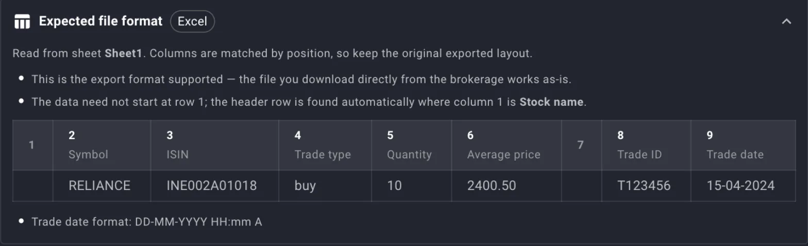
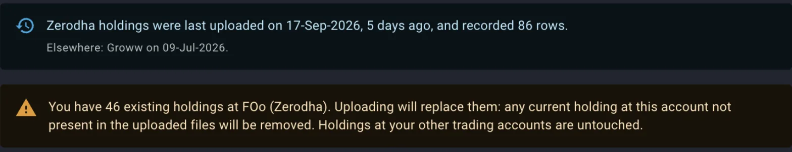
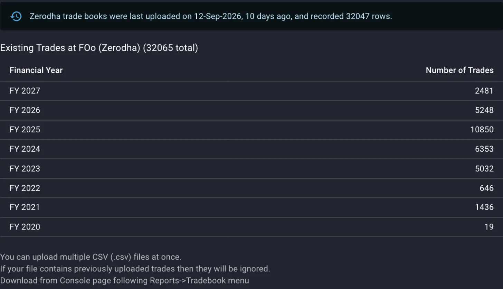
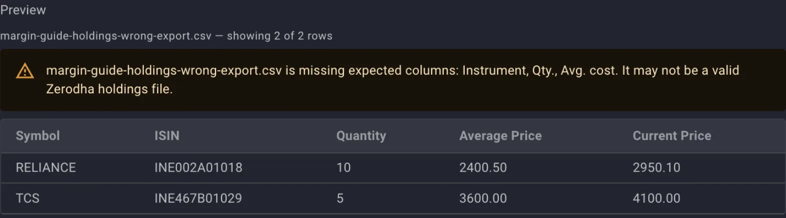
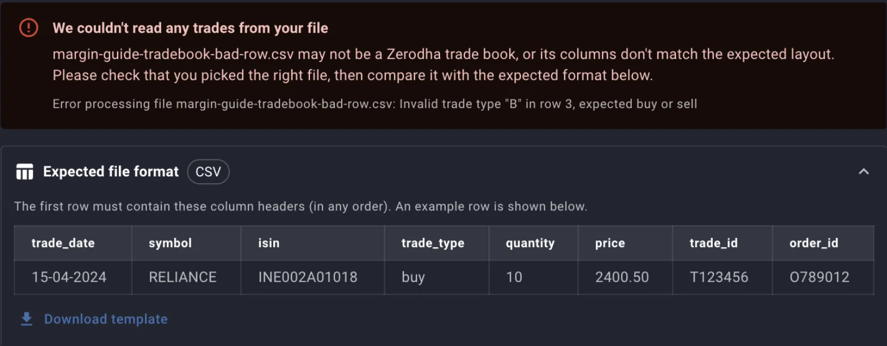

Everything Margin shows about your portfolio starts from two files your broker already produces: the holdings export, which says what you own today and at what average cost, and the tradebook, which lists every buy and sell that got you there. The two uploads share a dialog design and a trading account picker, and they differ in the one way that matters most, since a holdings upload replaces what the account held before while a trades upload only ever adds.

This guide covers what the dialogs do not print: what each file feeds, how a row is matched to a stock, what a re-upload does to the rows already on record, and what the first error messages mean.

## What each file feeds

A holdings file gives Margin the quantity and the average cost of every stock at one trading account. Those two numbers are the **Units** and **Avg Price** columns on the [dashboard](/guides/dashboard-columns), and buy value, current value, profit and the allocation gap are all worked out from them. The average cost is the one the broker exported, taken as it is.

A tradebook gives Margin the dates and prices behind those positions. XIRR, realised and unrealised gains, tax by holding period, the first and most recent trade prices, and the **Per Trades** side of the [consistency check](/guides/consistency-check) are all summed from the trades on record, and none of them can be computed from a holdings file, which has no dates in it.

Upload both, because a holdings file alone gives you a dashboard and nothing about returns, while a tradebook alone gives you returns for stocks with no position on the dashboard. Every stock in either file is also added to the stocks Margin tracks for you, so it shows up in **Your Lists** and can be valued.

## Where the uploads live

**Upload Holdings** and **Upload Trades** sit in the row of buttons under the tiles on the dashboard, the first item under **Portfolio** in the top navigation. **Upload Trades** is also on the Trades screen, beside the tabs. The two tiles **Last Holdings Update** and **Latest Trade** on the dashboard say how current each file is.

On a phone the upload buttons are hidden. To upload from one, switch on **Show desktop actions on mobile** on your profile page.

## Which trading account the file belongs to

Both dialogs open by asking for the trading account, and the helper text under the picker states the rule: the file is read in the format of that account's brokerage. Pick an account at the wrong broker and the columns are looked for under the wrong headers, which is the most common reason a file that opens fine in a spreadsheet reads as empty here. With one trading account the picker is filled in for you.

Two rules are not visible in the picker:

- Files from two accounts at the same broker need two trading accounts, one per account. A second file sent to the same trading account is not kept separate, and for holdings it is merged with the first, as the section on what a holdings upload replaces explains.
- For a broker Margin does not read yet, add a trading account with a brokerage of **Other** and save your broker's export as a CSV in the layouts below. [When Margin cannot read your broker's file](/guides/unsupported-broker-formats) lists the brokerages read as downloaded and explains how to send a format so it can be added.

## Getting the files from your broker

For a supported brokerage the file is uploaded in the form the broker's console or app exported it, with no editing. Where Margin knows the menu path it prints it under the file picker.

Two mistakes at the download step account for most refused files:

- The holdings file is the export of current positions, one row per stock with a quantity and an average cost, while the tradebook is the report of executed trades, one row per fill, carrying its own trade id. An order book, a contract note or a P&L statement is a different report and will not read as either.
- A tradebook covers whatever date range you asked for. Download the full range you have held the account, one financial year at a time if the broker limits the range, and upload every file. The Trades screen and the [consistency check](/guides/consistency-check) both assume the tradebook is complete, and a year left out shows up as a gap between what your trades add up to and what you hold.

## CSV and Excel

Which of the two a dialog accepts depends on the brokerage, and when both are accepted a **Select file type** toggle appears above the file picker with Excel chosen first. The toggle also filters the file chooser, so a file of the other kind is refused at selection with a message naming the extension it wanted.

The two kinds are read differently, and the **Expected file format** panel in each dialog shows which applies:

- A CSV is read by header name. The first row must carry the headers the panel lists, in any order, and extra columns are ignored. Blank lines are skipped.
- An Excel file is read by position from one named sheet. Margin finds the header row by looking down one column for a marker value, then reads fixed column numbers from the row below it, so the title block the broker puts above the table does no harm, and neither does a column you hide, but a column you delete or insert shifts every value after it into the wrong field.

*An Excel tradebook layout. Columns 1 and 7 are read past, and the header row is found wherever column 1 says Stock name.*

An Excel file is read until the first row with neither a symbol nor an ISIN, which is how the totals row at the bottom of a broker export is left out. The same rule means a blank row in the middle of the table ends the read there, and every row below it is left out without any warning. For a holdings file that matters, because the rows left out are then treated as no longer held.

Uploads take up to 50 files at a time and 10 MB per file. Several files sent together are read as one batch, so a year per file works for a tradebook.

## The generic layout for holdings

The Other layout for holdings is four columns, and the **Download template** button in the panel gives you a file with the headers and one example row.

| Header | Required | What Margin reads |
|---|---|---|
| `symbol` | Yes, unless `isin` is filled | The NSE trading symbol, matched first |
| `isin` | No | Matched when the symbol is blank or unknown |
| `quantity` | Yes | Units held. Commas, spaces and a rupee sign are stripped before reading |
| `average_price` | Yes | Average cost per share, read the same way |

A quantity or price that is not a number after stripping stops the file with a message naming the row, and nothing from any file in the batch is saved.

## The generic layout for trades

The Other layout for trades is eight columns, three of them optional.

| Header | Required | What Margin reads |
|---|---|---|
| `trade_date` | Yes | `YYYY-MM-DD`, `DD-MM-YYYY`, `DD/MM/YYYY`, or `YYYY-MM-DD HH:mm` with or without seconds |
| `symbol` | Yes, unless `isin` is filled | The NSE trading symbol |
| `isin` | No | Matched when the symbol is blank or unknown |
| `trade_type` | Yes | `buy` or `sell`, in any case |
| `quantity` | Yes | Units in this fill |
| `price` | Yes | Price per share for this fill |
| `trade_id` | No | The broker's id for the fill |
| `order_id` | No | The broker's id for the order the fill belongs to |

Two rules decide whether a re-upload duplicates anything:

- With `trade_id` filled, a trade already on record under the same id is skipped, and the same order id, when present, is part of the match.
- With `trade_id` blank, Margin derives an id from the date, the symbol, the side, the quantity and the price, and a second row in the same file identical in all five gets a numbered suffix so both are kept. A genuine second fill identical in all five that arrives in a later file is taken for the first and skipped, so fill in the broker's ids whenever the export has them.

A date that matches none of the formats, or a `trade_type` that is not buy or sell, stops the file with a message naming the row. As with holdings, nothing from the batch is saved when any file fails.

## How a row is matched to a stock

Each row is placed against Margin's stock list in a fixed order: the symbol first, then the ISIN, then the ISIN a stock used to have when the company has changed it, and lastly the symbol again with a series suffix such as `-BE` removed and case ignored. A row that matches at none of these steps is not saved, and it is listed under **Stocks Not Found** with the symbol and ISIN from the file so you can see what was skipped. The rest of the file is saved as normal.

A stock lands here when it is not in Margin's list at all, usually a recent listing, a symbol the exchange has renamed, or an instrument that is not an NSE equity sitting in the same export. **Add** on the dashboard searches the same list, so it cannot add the position either; send the symbol and ISIN through the feedback form and upload the file again once the stock is there.

## What a holdings upload replaces

A holdings file is taken as the complete list of what the trading account holds now. Saving it does three things, and the **Changes Summary** counts each:

- **Added** is a stock in the file with no holding at this account before.
- **Updated** is a stock already held here, with its units and average cost overwritten by the file's.
- **Removed (not held)** is every holding at this account that the file does not mention. These are deleted.

*Both notes appear before you pick a file. The first says when this brokerage's holdings last went in and how many rows; the second says what a new file will do to the 46 on record.*

The removed count is the one to read. Sold a stock since the last upload and it should be one; upload a partial export, one page of a longer list, and it is every stock that fell off the page. The undo is to upload the full file again, which restores the rows with the counts reversed. Holdings at your other trading accounts are never touched.

Two cases leave the account exactly as it was: a file from which no rows could be read, which the dialog reports as **No holdings were read from your file**, and a file whose rows were read but none of which matched a stock. Neither removes anything, because the deletion runs only after at least one row has been saved.

A stock that appears on more than one row, or in more than one file in the same batch, is saved once with the quantities summed and the average cost weighted by quantity. Sending two accounts' files to one trading account merges them this way, and the per-account picture is gone.

## What a trades upload adds

A tradebook upload never deletes. Each trade in the batch is looked up by its ids across all your trading accounts before anything is written:

- Already on record at this account: skipped. This is why the same file can be sent twice, and why a tradebook downloaded again for a longer range only adds the trades that are new.
- On record at one of your other accounts: moved to this one, and the dialog reports how many. This is the fix for a tradebook sent to the wrong account, since re-uploading it under the right one moves the trades instead of copying them.
- Not on record anywhere: inserted.

*The dialog shows what is already on record before you add to it. A financial year that should have trades and does not is the year to download.*

Afterwards the dialog lists the inserted trades by financial year, April to March, and by stock with the net quantity these trades add, buys less sells. **No new trades were added** means every trade was already on record, or none of the stocks could be matched, and a **Stocks not found** table under the message says which of the two it was.

The only way to take trades off the record is on the Trades screen, with the delete on a row or **Delete All Trades**.

## Reading the first errors

The dialogs check a CSV before it is sent, and the server checks every row after. Where each message comes from tells you what to fix.

**Before upload, in the preview.** Choosing a CSV shows its first five rows with the headers Margin recognises in full colour and the rest dimmed. A required header that is missing gets a warning naming it. The cause is nearly always that the file is a different report, or that the trading account is at a different broker from the one that exported it.

*A file with a plausible layout for some broker, chosen against a trading account at another. The preview names the three headers it looked for, and the upload would read every row as empty.*

**After upload, the whole batch refused.** A value Margin cannot read stops the upload with **We couldn't read any trades from your file**, and the small line under it names the file, the row and the value. The row number counts the header as row 1. Nothing from any file in the batch is saved, including the rows that were fine, so fix the row and send the batch again.

*Row 2 of this file was valid and was not saved either. The expected format opens below the error so the row can be compared against it.*

The three values that stop a file this way are a quantity or price that is not a number, a date in none of the accepted formats, and a trade type other than buy or sell. An Excel tradebook with a bad trade type reports **Invalid trade type** without a row number.

**After upload, rows passed over.** **Stocks Not Found** is not an error; the rest of the file was saved. The section on matching says what puts a row there.

**The wrong count.** A holdings upload that reports far more removed than you have sold, or a trades upload that reports nothing added when the file is new, is an upload that read the file but not the way you meant, and the trading account is the first thing to check.

## Where to go next

- [Dashboard columns](/guides/dashboard-columns) reads the units and average cost the holdings file just supplied.
- [The consistency check](/guides/consistency-check) compares the two uploads and names the splits and bonuses a tradebook never records.
- [The funds statement, net invested and charges](/guides/funds-statement-ledger) is the third upload, for the money you moved in and out.
- [Holdings from your broker into Margin](/recipes/holdings-into-margin) and [A financial year of trades into Margin](/recipes/tradebook-into-margin) cover the same uploads through the API, for an agent.
- [When Margin cannot read your broker's file](/guides/unsupported-broker-formats) covers a broker missing from the list.
