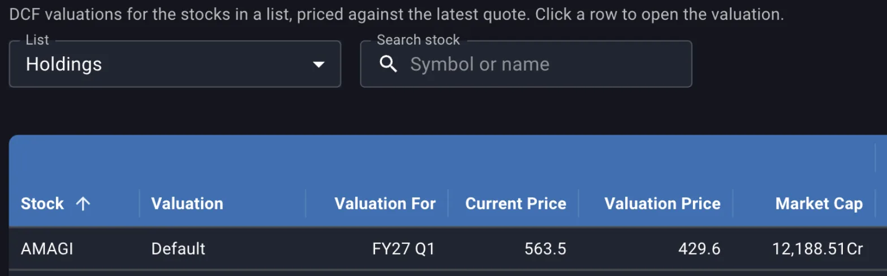
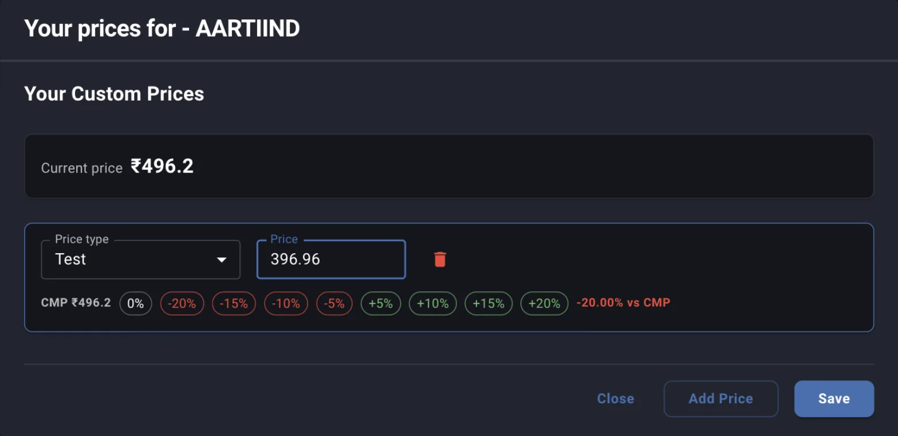
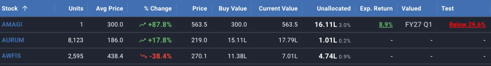
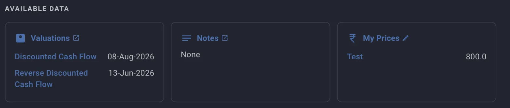

An anchor is a price you decide on before the market reaches it, stored against the stock so that the decision is made while you are reading the business and not while the screen is moving. Margin keeps the number and reports one thing about it wherever the stock appears: how far the day's closing price sits from it, as a percentage, in a colour you chose for that side.

Margin ships no anchors of its own. Buy, Add, Reduce and Exit are names you create, and the app attaches no meaning to any of them. The meaning is the rule you wrote down, and the column only tells you when the price has arrived.

## Creating the price types

Anchors start in **Settings**, under **Price Types**, on a desktop-width screen. Under **Custom Price Types**, **Add** gives you a row, and each row is one anchor you will later price per stock.

**What you set**

- **Price Type Name**, which becomes the column heading on the dashboard and on your lists. Short names read better in a narrow column, so *Buy* beats *Buy below this*. The name is required and Save stops on a blank one.
- The **Below Target** and **Above Target** colours, which decide how the cell reads when the market is under your anchor and when it is over.
- **Dashboard** and **Lists**, which decide where the column appears. They are independent, so a type can be on one, both or neither.

**What Margin does**

- **Save** at the bottom writes the custom types and the standard toggles above them in one go.
- Every type you create is a column wherever you switched it on, whether or not you have priced it on any stock. Four anchors means four columns, so create the ones you will actually use.

The **Standard Price Types** table above is a different thing. **First Trades** and **Recent Trades** are computed from your tradebook, and **Exp Return (Rev DCF)** comes from your reverse DCF. They record what you did and what your model implies, and none of them is a price you decide. [Reading the dashboard columns](/guides/dashboard-columns) covers how those three behave as columns.

## What each of the four records

The four names carry the four decisions you are willing to make about a stock in advance.

- **Buy** is the price at which a business you have finished researching becomes a position. It is also the only one of the four that applies to a stock you do not own, since the other three describe what to do with a position you already have.
- **Add** is the price at which you would put more into a position you already hold. It is usually below your Buy, since adding on the way down is what an allocation plan is for, and it is the anchor to read beside **Unallocated** on the dashboard, which tells you whether the plan leaves any room to add at all.
- **Reduce** is the price at which the position has run far enough that you would trim it back towards its target weight.
- **Exit** is the price at which your reason for owning it no longer holds at any size.

None of these is a forecast, and Margin publishes no target prices of its own. An anchor is a commitment about your own behaviour, and its value comes from being written when you were calm enough to justify the number.

## Deriving the anchor from a valuation

A round number is easy to remember and has nothing behind it. The number with something behind it is already on the **Valuation** menu, under **DCF**, which lists every DCF you have saved for a chosen list and puts two prices side by side.

*Current Price is the last quote. Valuation Price is what your own DCF says the share is worth today.*

**Valuation Price** is the intrinsic value per share your DCF reaches for today, discounted back from the projection and the terminal value, on whichever basis that valuation sends to the dashboard, profit or cash flow. It moves only when you change the valuation, so it is a stable base to take a margin of safety from. A Buy anchor derived this way is the Valuation Price cut by the discount you want for being wrong, and you can put the cut in yourself with the percentage chips in the price dialog.

The other route starts from the return you require instead of the value. Open the DCF, press **Show NPV & Intrinsic Value Columns** so the **EXPECTED RETURNS** group appears at the right of the grid, then change **Price** in the Enterprise Value section and watch the return for your horizon year move with it. Mark the price down until the return clears your hurdle, note that price, and leave the valuation without saving, since the what-if price is never saved with a DCF. The price you noted is the Buy anchor, and it answers a question the Valuation Price does not: what this share has to fall to before owning it pays you enough. [Using the DCF valuation grid](/guides/dcf-valuation-grid) covers the what-if price in full.

Expect the two figures to disagree. **Valuation Price** compares your value today against today's quote, while **Exp. Return** on the dashboard compares the value your projection reaches at the horizon year against the quote adjusted for net debt, annualised over those years. A stock quoted above its value today can still show a positive expected return, because the value is growing over the years you projected. Use the Valuation Price when you want the anchor to mean *worth this much now*, and the what-if price when you want it to mean *pays me enough from here*.

The reverse DCF cannot be used this way. Its **Price** field is read only and always the live quote, so it tells you the growth rate the market is already asking of the business. Read it to decide whether that growth is believable, then set the anchor from the DCF.

## Setting the price on one stock

A price type gives you the column; the number in it is set per stock. The rupee icon in a row's actions opens **Your prices for** that stock, on the dashboard and on any list, and so does the pencil on the **My Prices** panel in the stock's detail view.

**What you set**

- **Add Price** gives you a row. Pick the **Price type** and type the **Price**.
- **Adjust from** switches the base between **CMP**, the current price, and **Avg**, your average cost, and appears only when the stock has both.
- The percentage chips set the price to that base plus or minus the step, which is how a margin of safety goes in without arithmetic. The figure after the chips reads back where the price now sits against the base, whichever way you got there.
- The bin removes a row.

**What Margin does**

- A type can be used once per stock. Two rows on the same type stop the save with *Duplicate price types are not allowed*.
- **Save** writes to the server there and then; there is no page-level save behind it.
- Saving also deletes any row you removed, so the dialog holds the complete set of anchors for that stock.

The readback in the dialog and the figure in the column measure the same gap from opposite ends. Set a Buy anchor of 800 on a stock quoted at 563.5 and the dialog says the anchor is 41.97% above the market, while the column says the market is 29.6% below the anchor. The dialog is helping you place the number against the price; the column is telling you how far the price has to travel.

## Anchors on stocks you do not own

An anchor is most useful on a stock you have researched and not bought, and Margin tracks such stocks alongside your holdings. Search for it in **Search a stock to add to this list** on any of your own lists, which starts tracking it, and the rupee action on its row opens the same dialog.

*On a stock you have never traded there is no average cost, so the base is the current price alone and the Adjust from switch does not appear.*

Two things follow from not holding the stock. The dialog offers only the current price as a base, since there is no average cost to work from. More importantly, the stock will never appear on the dashboard, which holds holdings only, so the anchor is visible only through a list. Tick **Add to lists** on the price type in Settings, or the column that carries the anchor will be missing from the only screen where these stocks show up. The generated **Not Currently Held** list collects every stock you track without a position, which makes it the natural place to watch a set of Buy anchors.

## Reading the anchor beside expected return

On the dashboard the anchor column sits next to **Exp. Return** and **Valued**, and the three answer different questions about the same stock.

*The market is 29.6% below the anchor of 800. The default colour pair prints that in red, though on a buy anchor a price under your number is the good outcome.*

- The anchor column reads **Above 12.3%** or **Below 29.6%**, meaning the day's close is that far above or below your number. Clicking the cell opens the price dialog for that stock.
- **Exp. Return** is what your DCF implies from today's price over the horizon you chose. An anchor that has been reached while the expected return is poor means the valuation behind the anchor has aged.
- **Valued** is the quarter the most recent valuation was made for, and it is the column to check before acting on either of the other two.
- A dash in the anchor column means no price of that type is set for that stock.

Quotes refresh once a day after market close, so a cell flipping from Below to Above is an end of day event. An anchor is not an alert and Margin will not act on it or tell you when it is hit.

## Colours that say what you mean

Each type carries its own pair of colours, and the pair is worth thinking about once for each anchor rather than accepting the default everywhere. The default pair, **Classic**, prints below in red and above in green, which reads as loss and gain. On a Buy anchor that is backwards, because a price under your number is when you want to act. Reversing the pair on your buy-side anchors, and leaving the sell-side ones as they are, makes the colour mean *act* on every column instead of meaning *down*.

Pick a preset pair or open either colour for the full palette. Margin shows how each colour reads on the light and the dark theme and warns when one of them is too faint, which matters because the anchor column is scanned at a glance and never read carefully. **Color blind safe** swaps the red and green for orange and blue.

## What is saved, and what a deleted type takes with it

- **Save** in the price dialog writes that stock's anchors immediately, including the removal of any row you deleted.
- **Save** on the Price Types settings writes the types, their colours and their column checkboxes.
- Renaming a type keeps every price already set against it; only the column heading changes.
- Deleting a type and saving deletes every price recorded against it, on every stock, permanently. There is no separate confirmation for the prices, so a type you no longer want a column for is better unticked from **Dashboard** and **Lists** than removed.
- An anchor keeps no history. Change the number and the old one is gone, and nothing on screen says when the current one was set.

## Revisiting an anchor

Nothing in Margin recomputes an anchor or expires it. The number you typed stays until you change it, which is the point of writing it down, and it also means the review has to be a habit rather than a notification.

The price moving is not a reason to move the anchor. The business changing is, and so is your valuation changing, since an anchor derived from a DCF is only as current as that DCF. The stock's detail view puts both facts in one place.

*The anchor in rupees, next to the dates of the valuations it was derived from. The dashboard column never shows this number, only the distance to it.*

Read the anchor against those dates. A Buy anchor set from a DCF made six quarters ago is a number from a company that has reported twice since, and the fix is to redo the valuation and then move the anchor, in that order. When results change the business enough to move your projection, revisit the anchor in the same sitting, while the reasoning is in front of you.

## Where to go next

- [Reading the dashboard columns](/guides/dashboard-columns) covers the column mechanics in detail, including the standard price types and the same columns on your lists.
- [Using the DCF valuation grid](/guides/dcf-valuation-grid) is where the Valuation Price and the what-if price come from.
- [Tracking expected returns via the dashboard](/guides/tracking-expected-returns-dashboard) covers the hurdle an anchor is usually derived against.
- [Setting and reading target allocation](/guides/target-allocation) is where the room to act on an Add anchor is decided.
