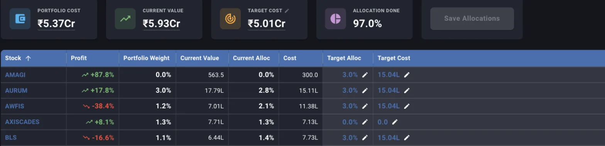
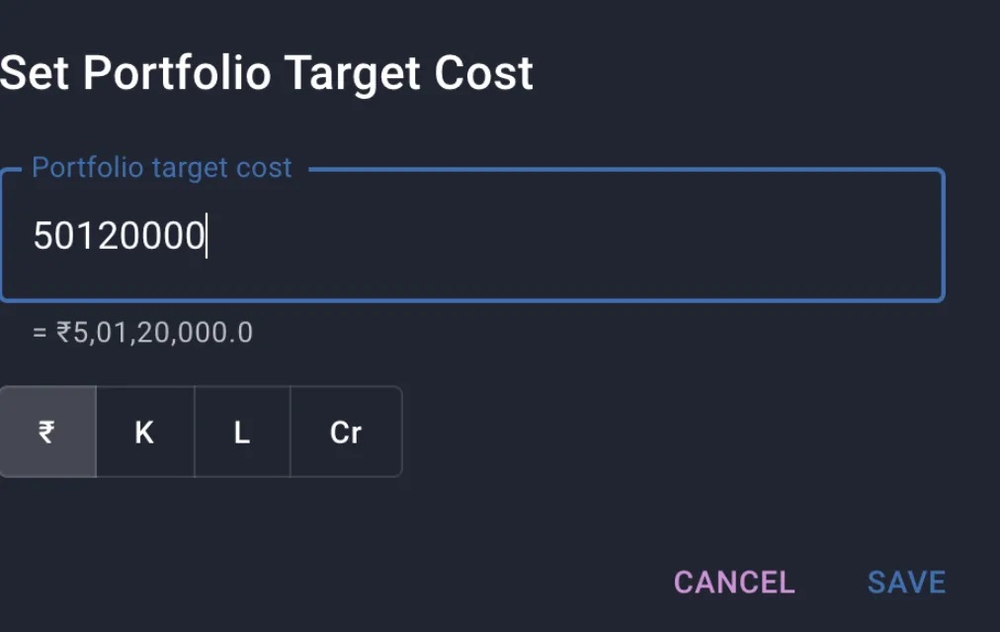
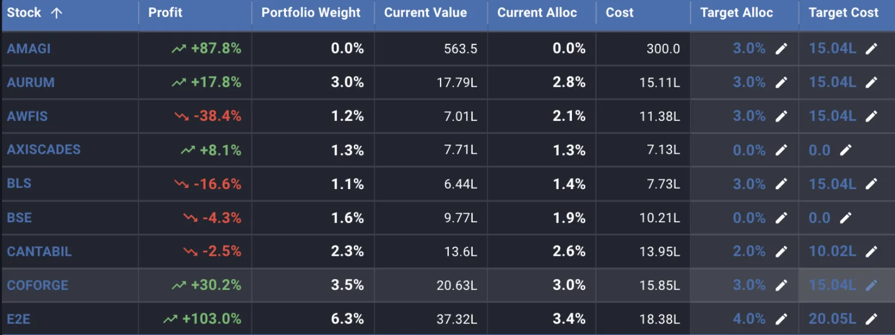

Target allocation is a plan you write once, in money you intend to pay. Portfolio weight is where prices have since taken you. The Allocation screen holds the plan, and it puts the two side by side as percentages so you can read the gap between them without doing the division yourself. Nothing on this screen watches your holdings for you; the targets sit exactly where you last typed them until you come back and change one.

## Opening Allocation

Allocation lives under **Portfolio** in the top navigation, alongside Dashboard, Trades, Dividends, Ledger and Unrealised Gains. The screen has one table, one stock per row, plus four summary figures and a save button above it.

*Target Alloc and Target Cost are the only editable columns, shown in blue with a pencil. Everything else on the row is read from your trades and today's price.*

## Setting the portfolio target cost

Before a single stock's target means anything, the portfolio needs a target cost of its own: the total you are building the book towards, in rupees. Click the **Target Cost** tile to set or change it.

*Type digits or use the K / L / Cr buttons to enter a compact figure like 5Cr; the resolved rupee amount shows underneath as you type.*

This figure is the denominator every stock's target percentage is measured against, so raising or lowering it rescales every stock's rupee target immediately, without touching any stock's percentage. If you have not set it yet, the table warns you above the rows, and every stock's **Target Cost** column shows a dash until you do; **Target Alloc** still accepts a percentage in the meantime, it just has no rupee figure to resolve to.

The grid's edit cells lock while this dialog is open, so finish setting the portfolio figure before you move on to individual stocks.

## Giving a stock its target

Each row has two editable cells, and they are the same number in two units:

- **Target Alloc**, the share of the portfolio target cost you want in this stock, as a percentage. Click the value to edit it in place.
- **Target Cost**, what that percentage works out to in rupees, given the portfolio target cost you set above. Editing this cell backs out the equivalent percentage and stores that instead.

What Margin actually stores is the percentage. Typing a rupee figure into **Target Cost** is a convenience: it divides by the portfolio target cost and saves the result as **Target Alloc**, so the two cells never disagree. Leave a cell empty and press enter and Margin drops the edit rather than saving a blank; the old value stays.

An edited row turns green until you save it. **Save Allocations**, above the table, only writes the rows you touched, and it stays disabled until something has changed.

## What the rest of the row is measured against

The five columns you cannot edit come from your trades and today's closing price, and three of them share a name with the two you can:

- **Profit** is the same gain-since-purchase figure as the dashboard's **% Change** column: today's price against your average cost.
- **Cost** and **Current Value** are the stock's own totals: units times average cost, and units times today's price.
- **Current Alloc** is this stock's **Cost** as a share of the **Portfolio Cost** tile, the total you have actually paid across every holding.
- **Portfolio Weight** is this stock's **Current Value** as a share of the **Current Value** tile, the total everything is worth today.

**Current Alloc** and **Target Alloc** are both measured against a cost total, one actual and one aspirational. **Portfolio Weight** is measured against a value total that moves with the market every day. Margin lines all three up as plain percentages, which is what lets you read a gap between them at a glance, but the percentages are shares of three different totals, and knowing which total moved is the whole job of reading the row correctly.

## Why a winner drifts past its target on its own

Take E2E in the screenshot below: **Target Alloc** 4.0%, **Current Alloc** 3.4%, **Portfolio Weight** 6.3%, on a position up 103% since purchase.

*E2E's cost-based figures sit close to plan; its price-based figure has run far past both.*

**Current Alloc** only moves when cost moves, when you buy or sell something, anywhere in the portfolio. It has no idea what E2E trades at today. **Portfolio Weight** is repriced every day the market is open, on both sides of the fraction: E2E's own value and the total value of everything else. A stock can sit exactly where you last left it, cost-wise, untouched for months, and still climb steadily up the **Portfolio Weight** column purely because its price outran the rest of the book. That is the whole gap between a plan written in cost and a portfolio read in value: cost sits still until you trade, price never does.

Whether a stock that has drifted past its target this way is a reason to trim it is not something this screen decides. Margin has no sell or rebalance action wired to the allocation gap; the only figure the gap drives is a buying one, covered next. Reading **Portfolio Weight** against **Target Alloc** tells you a position has grown past the share you planned for it. What to do about that growth is a call the numbers here do not make for you.

## Sizing a purchase, not triggering a rebalance

The gap Margin does act on is **Target Cost** minus **Cost**: money left to reach the target you set, in rupees. It appears in full on the dashboard, as **Unallocated** on the row and as **Left To Buy** in the stock's detail panel, covered in [Reading the dashboard columns](/guides/dashboard-columns#unallocated). On this screen you can read the same figure by eye as **Target Cost** less **Cost** on any row.

This figure is built entirely from cost, the same side of the ledger as **Target Alloc** and **Current Alloc**, and deliberately not from **Portfolio Weight**. A stock trading well above where you bought it can still have room left to buy by this measure, and a stock trading below your cost can already be fully bought. The figure answers one question only: how much more money would bring this stock's cost up to the target you wrote down. It says nothing about whether today's price is a good one to pay for that last tranche; **Exp. Return**, next to it on the dashboard, is where that judgement comes from.

## Allocation Done

The **Allocation Done** tile sums every stock's **Target Alloc** and compares it against 100%. It is a completeness check on the plan itself, not on how much you have invested: a portfolio at 60% here has only earmarked 60% of the target cost to specific stocks, whatever fraction of that money has actually been spent.

## Uploading targets in bulk

**Upload CSV**, above the table on a desktop-width screen, sets many stocks' targets from a file in one pass instead of clicking through each row. One row per stock, a header row first, and either a **percentage** or an **amount** column filled in per stock, not both; if you give amounts and the portfolio target cost is not set yet, Margin derives one from the amounts. Symbols in the file that are not already on your allocation table are skipped and named back to you after the upload. Unlike editing a cell, an upload commits immediately: there is no green row to review and no separate save step, so check the file before you send it.

## Where to go next

- [Reading the dashboard columns](/guides/dashboard-columns) covers **Unallocated** and the stock detail panel's **Left To Buy** figure, the dashboard's view of the same gap this screen sets the targets for.
- [The consistency check](/guides/consistency-check) is worth running before you trust either **Cost** column here: a split or bonus missing from your tradebook throws off cost, and both **Current Alloc** and **Target Alloc** are built on it.
