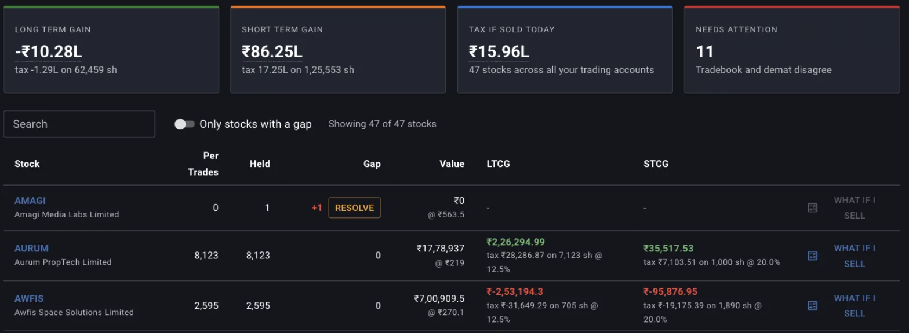
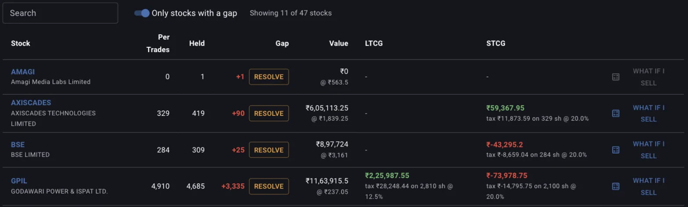
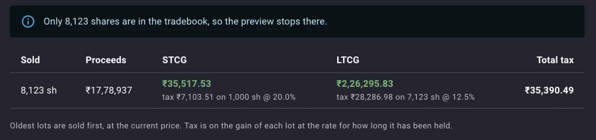
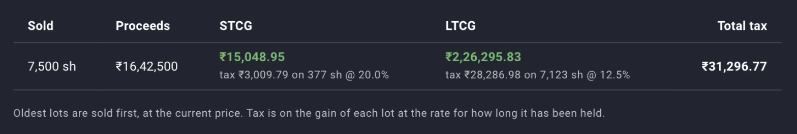

Every share you still hold carries a gain you have not paid tax on yet, and how much of it the tax would take depends on when you bought that particular share. The Unrealised Gains screen puts a number on it: for each stock, the gain on the shares your tradebook says are still unsold, split by how long each lot has been held, with the tax each band would attract if you sold the whole holding today. Nothing on this screen is saved and nothing is a trade. Every figure is recomputed from your trades, your corporate actions and the last quote each time you open it.

## Opening the screen

Unrealised Gains has its own entry under **Portfolio** in the top navigation, alongside Dashboard, Trades, Dividends, Ledger, Allocation and Consistency. The figure this guide is named for sits in the third of the four summary cards at the top, **Tax If Sold Today**.

Only stocks your demat import currently holds are listed. A stock you have sold out of entirely drops off, however much tax the sale cost you, and so does a stock that exists only in your tradebook with no holding behind it. The list is your present portfolio priced for an exit, and it carries no record of what you have already sold.

## What the four cards add up

The cards across the top total every listed stock, gapped ones included.

- **Long Term Gain** and **Short Term Gain** are the gains on the unsold lots in each band, with the tax and the share count underneath.
- **Tax If Sold Today** is the two bands' tax added together, over the number of stocks named beneath it.
- **Needs Attention** counts the stocks whose tradebook and demat holding disagree, and its subtitle switches to the number of stocks with no quote when there are any.

A loss carries through as a negative tax, the band rate applied to a negative gain, so a stock underwater pulls the band total down and pulls the headline tax figure down with it. A portfolio can therefore show a long term gain of minus ten lakh with a tax figure of minus one and a quarter lakh beside it, which is only that same arithmetic run over a net loss.

*The long term card is negative here because the losses across the portfolio's long term lots outweigh the gains. AMAGI's two gain columns are blank because its tradebook holds nothing unsold, even though the demat says one share.*

## Why one holding sits in both bands

Margin does not treat a holding as one average position. It rebuilds it as lots, one for each buy, each carrying its own quantity, its own cost per share and its own acquisition date, and it consumes the oldest lot first when you sell. A holding you have added to over three years is a stack of lots of different ages, and the twelve month line runs through the middle of it, so the same stock shows a figure in the LTCG column and another in the STCG column.

Corporate actions move lots around the way the tax rules do. A split or a consolidation reapportions the existing cost across the new share count and leaves the acquisition date alone, so shares you have held for years stay long term through a split. Bonus shares cost nothing and form their own lot dated the ex date, which starts a fresh twelve month clock on them while the original shares keep theirs. A demerger cuts the parent's cost per share by the fraction apportioned away. Margin can only do this for the corporate actions it has synced from the exchange feeds or that you have recorded yourself, which is why an unrecorded bonus distorts the split between the two bands as well as the totals.

## The rates Margin applies

The bands and rates come from a table of capital gain rates that is effective by date, and Margin reads the row in force today, because the sale it is pricing is a sale made today. For India that is 20% on gains from shares held up to twelve months and 12.5% beyond twelve months, both applying to sales from April 2024. Gains realised before that date fell under 15% and 10%, which is why the same screen would have shown different figures two years ago and will follow the table again when a rate changes.

Each lot's gain is its quantity times the difference between the last quote and its cost per share, and the tax is that gain times the band's rate. No exemption threshold is deducted, no surcharge or cess is added, no charges on the sale are taken off the proceeds, and nothing is set off against losses from outside this portfolio. Read the figure as the size of the tax event you would trigger, and expect your filed number to differ.

## Reading a row

**Per Trades** is the quantity your tradebook accounts for as still unsold, after Margin has applied the corporate actions it knows about. **Held** is what your demat import says. **Gap** is measured against the raw buys and sells in your tradebook, before any corporate action Margin applied for you, so on a stock with an unrecorded split the three columns will not subtract cleanly. A 5x split applied to the lots but never recorded as trades shows up as a Per Trades figure close to the demat quantity sitting next to a gap of thousands of shares.

**Value** is the unsold quantity at the last quote, with the quote itself underneath it, and quotes come from the exchange bhavcopy at the close rather than from a live feed. The **LTCG** and **STCG** cells carry the gain in that band, and beneath it the tax, the number of shares it falls on and the rate applied to them. A dash means the band is empty: either no lot is that old, or there is nothing unsold in the tradebook at all.

Clicking the symbol opens that stock's own screen, and Margin carries Unrealised Gains along as the place you came from, so a breadcrumb back to this table survives a further step into the stock's valuation or chart.

## When a figure cannot be trusted

Where the tradebook and the demat disagree, the gain is worked out over the wrong number of shares, at a cost per share that may also be wrong, and both bands inherit the error. The row still prints its figures. Margin flags the stock with a red gap and a **Resolve** button that takes you into the consistency check for that stock, and counts it in **Needs Attention**, but it does not blank out the numbers, so a gapped row is a figure to leave alone until you have closed the gap.

The **Only stocks with a gap** switch narrows the table to those rows, and the **Search** box filters by symbol or company name. The count beside them says how many of the total you are looking at.

*GPIL's gap of 3,335 shares comes from a 5x split that was never recorded, and its gain figures are still shown. AMAGI's What if I sell button is greyed out because there is nothing unsold in its tradebook to price.*

## What if I sell

**What if I sell**, at the end of every row, prices a partial exit. It opens on the full unsold quantity and recalculates every time you change the number, so you can walk a quantity up and down and watch the tax move with it.

- **Sold** and **Proceeds** are the quantity you asked for and what it would fetch at the last quote, gross of every charge.
- **STCG** and **LTCG** split that quantity by band, each with its tax, share count and rate, the same way the table does.
- **Total tax** is the two added together.

Ask for more shares than the tradebook holds and the preview caps itself at what is there and says so. Type something that is not a positive number and the field says **Enter a positive number**, and the table clears until the quantity is valid again. Closing the dialog leaves nothing behind, because the preview is a question put to the server rather than a trade recorded against your account. When you do sell, the sale reaches Margin the usual way, through your next tradebook upload.

*Asking for 9,000 shares returns 8,123, the whole unsold holding, at a total tax of ₹35,390 on proceeds of ₹17.8 lakh.*

## Selling across the twelve month boundary

Oldest lots are sold first, so the shares that leave first are the ones most likely to have cleared twelve months, and the short term lots are the last to go. The quantity in the LTCG cell is therefore the number of shares you can sell before the short term band is touched at all, and the preview is where you confirm it: enter that quantity and the STCG column reads None, enter a few hundred more and the short term tax appears on exactly those extra shares.

*Selling 7,500 of the 8,123 shares takes all 7,123 long term shares plus 377 short term ones, and the 377 carry ₹3,010 of the ₹31,297 total.*

Lots cross the line on their own as they age, and the screen recomputes against today's date each time it loads, so a stock's short term quantity shrinks over the months without you doing anything. The acquisition dates themselves are not on this screen, so it will tell you how many shares are still short term today and leave you to find in your tradebook when the next of them turns twelve months old. The tax figure prices an exit you are weighing for other reasons, and whether the difference between the two rates is worth waiting for is a judgement about the company and the price that the figure informs and does not settle.

## What the screen leaves out

Gains you have already realised have no screen of their own. A sale you made last year shows up in your returns, in XIRR and in the realised plus unrealised gain on a stock or list summary, and in the cash it put into your ledger, but not as a tax figure anywhere. This screen is only ever about shares you still hold.

The same band calculation appears in two other places, where it covers a narrower set of stocks. A stock's summary card carries a **Tax Information** block with the tax, the share count and the rate for each band, and a stock list's summary carries a **Tax Breakdown** across every stock in that list. Both answer the same question as this screen, asked of one name or of one list.

## One trading account at a time

The trading account picker at the top right scopes the whole report, cards included, to a single account, and the Tax If Sold Today card names the scope you are reading. Holding the same stock at two brokers means two sets of lots with different dates, so the band split for the combined position and the band split at one broker are different numbers, and the one you want is the one for the account you would actually place the sale in.

## Where to go next

- [The consistency check](/guides/consistency-check) is where a gap on this screen gets closed, and where an unrecorded split or bonus gets entered.
- [Importing holdings and trades](/guides/importing-holdings-and-trades) covers getting the tradebook and demat file that everything here is built from into Margin.
- [Tracking expected returns from the dashboard](/guides/tracking-expected-returns-dashboard) is where the other side of a sale decision, what you think the stock is worth, sits.
